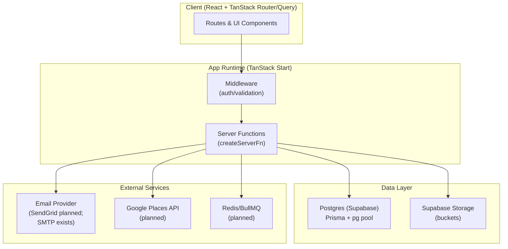
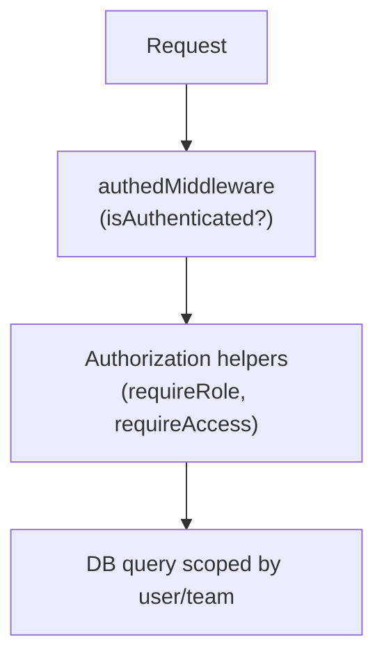
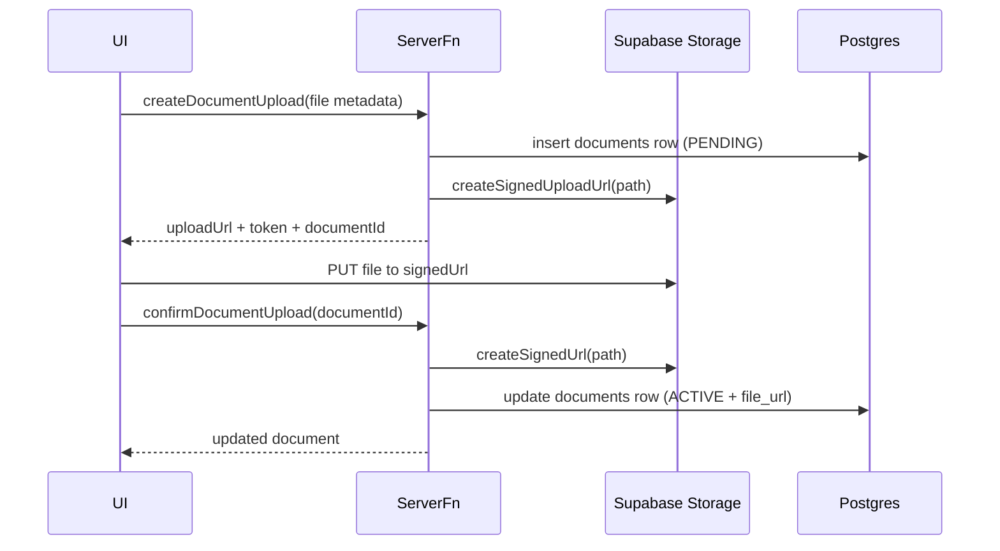
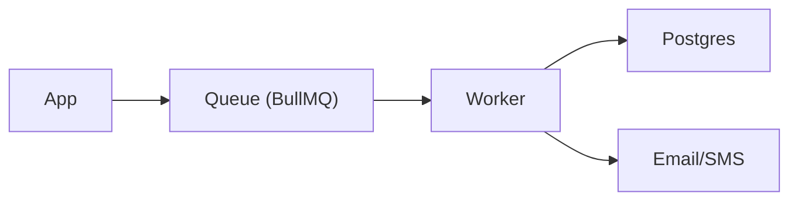

# Foundations (Architecture, Standards, Shared Flows)

**Updated:** 2026-01-02  
**Applies to:** All `EPM-*` issues  

## 1) System architecture (current)

### 1.1 High-level diagram

### 1.2 Key decision: multi-tenancy path (Option A)

For the next implementation phase we use **Option A: user-scoped ownership**.

- **Ownership concept:** “documents belong to a user” (via `uploaded_by_id`) and user can only access their own records.
- **Storage paths:** currently implemented as `{supabaseUserId}/{folder}/{type}/{uuid}-{fileName}` and may be migrated to `user/{id}/...` later.
- **Teams:** not implemented yet. When teams are added, we will introduce team-scoped authorization and storage paths as a migration.

## 2) Data model conventions

### 2.1 Table conventions

- Primary keys: UUID.
- Timestamps: `created_at`, `updated_at` (server-managed).
- Soft delete (where needed): either `status = DELETED` (documents) or explicit `deleted_at`.

### 2.2 Naming conventions

- **DB:** snake_case
- **TypeScript:** camelCase
- **Enums:** SCREAMING_SNAKE_CASE for values, PascalCase for enum names.

### 2.3 Access rules (baseline)

- All reads/writes are scoped by authenticated user id:
  - `managerId` on `properties`
  - `uploaded_by_id` on `documents`
  - Similar scoping will be required on tenants/leases/maintenance/payments as they get wired.

## 3) API/service conventions (TanStack Start)

### 3.1 File layout

Each domain gets:

- `{domain}.schema.ts` — Zod schemas and types
- `{domain}.api.ts` — server functions via `createServerFn`
- `{domain}.query.ts` — client query/mutation hooks & query keys

### 3.2 Error handling standard

**Goal:** consistent error envelope for UI.

Recommended standard:

- Throw typed errors with:
  - `code` (e.g. `UNAUTHORIZED`, `FORBIDDEN`, `NOT_FOUND`, `VALIDATION_ERROR`)
  - `message`
  - optional `details`
- Ensure HTTP status codes are set in middleware/handlers.

### 3.3 Pagination standard

- Inputs: `limit`, `offset`
- Output: `{ data, total, limit, offset }`
- Always return `total` count when feasible (or explain why not).

## 4) Auth & authorization

### 4.1 Current auth

- Better Auth configured in `src/server/auth.ts`.
- TanStack Start middleware reads auth context in `src/middlewares/auth.ts`.

### 4.2 Authorization layers

### 4.3 Role model (target)

We will standardize roles:

- Admin
- PropertyManager
- Maintenance
- Accountant
- Viewer

Implementation detail:

- `user.role` stored in DB; middleware uses it for gatekeeping.
- Per-record access checks must also exist (role alone is not enough).

## 5) Supabase Storage (Option A)

### 5.1 Upload lifecycle (recommended)

### 5.2 Storage policies

We will prefer **server-mediated operations** using the service role key, then add Storage RLS later for client-side direct access if needed.

## 6) Background jobs (future)

BullMQ planned for:

- late fee application
- lease expiration notifications
- document expiration notifications
- recurring maintenance schedule generation

## 7) Testing strategy (minimum viable)

- Unit tests: pure functions, validators, path builders
- Integration tests: server fns hitting a test DB
- E2E tests: Playwright covering key workflows

Minimum required per feature:

- happy path
- authorization failure
- validation failure
- idempotency/retry safety

