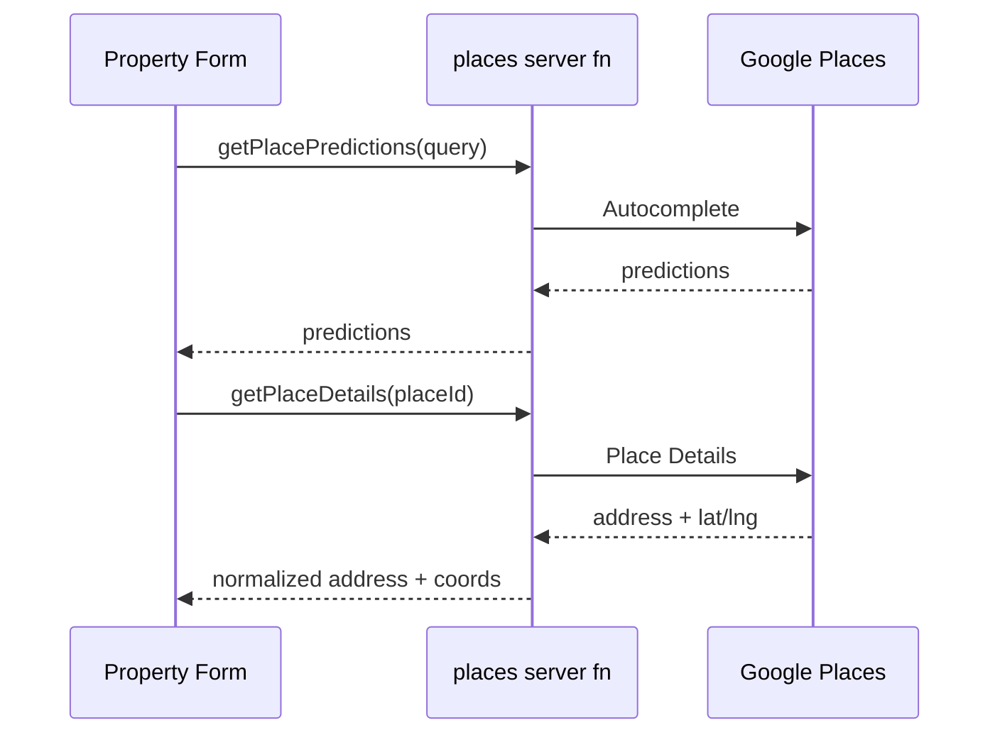
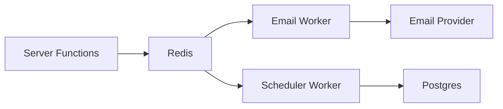
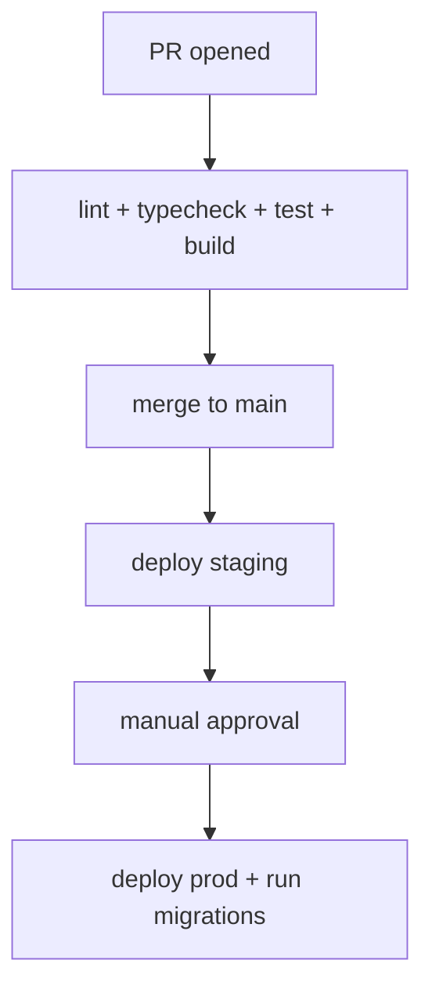

# Infrastructure & DevOps (EPM-1 → EPM-13)

**Updated:** 2026-01-02

## EPM-1 — Database Schema Implementation

### Goal
Ship a production-grade Postgres schema that supports MVP domain entities, with correct constraints, indexes, and RLS posture.

### Current repo status (evidence)
- Prisma schema exists: `prisma/schema.prisma`
- Supabase migration exists: `supabase/migrations/001_initial_schema.sql`
- Supabase migration applied: `20260101234914 property_management_schema` (per Supabase migrations list)

### Scope (MVP)
- Properties, Units, Tenants, Leases (+ co-tenants/addenda)
- Maintenance requests + comments + vendors
- Payments + expenses
- Documents
- Inspections + inspection items
- Audit logs

### Out of scope / deferred
- Team multi-tenancy tables (`teams`, `team_members`) **not yet implemented**
- Work order status history table **not implemented** (current model uses `maintenance_requests.status` + `maintenance_comments`)
- Security deposits as separate table (currently modeled in `leases`)

### Data model spec (canonical)
Reference: `prisma/schema.prisma` (source of truth for app types) and `supabase/migrations/001_initial_schema.sql` (DDL/RLS baseline).

#### Constraints
- Unique:
  - `properties`: none beyond PK
  - `units`: `@@unique([propertyId, unitNumber])`
  - `tenants`: `email` unique
  - `leases`: `leaseNumber` unique
- Foreign keys:
  - `Unit.propertyId -> Property.id`
  - `Lease.unitId -> Unit.id`
  - `Lease.tenantId -> Tenant.id`
  - etc.

#### Indexes (minimum)
- Properties: managerId, status, (city,state)
- Units: propertyId, status
- Tenants: status, email, (lastName, firstName)
- Leases: unitId, tenantId, status, endDate
- Maintenance: unitId, status, priority, assignedToId, createdAt
- Payments: tenantId, leaseId, paymentDate, status
- Expenses: propertyId, category, expenseDate
- Documents: type, propertyId, tenantId
- Inspections: propertyId, type, scheduledDate
- Audit: (entityType, entityId), userId, createdAt

### RLS spec (MVP baseline)
**Goal:** no cross-user data access.

Given the current Better Auth setup, ensure a stable mapping between app-user and DB user identity (see EPM-7 “authz helpers”).

Minimum policies:
- If using Supabase `auth.uid()` for end-user queries: policies should use that.
- If server-only access (service role): enforce scoping in server functions + keep RLS strict for `anon/authenticated`.

### Migration/testing plan
- Create/validate a repeatable migration procedure:
  - Apply migration on a fresh dev database
  - Run smoke queries for each table + FK integrity checks
  - Validate indexes exist (`pg_indexes`)

### Observability
Log:
- migration version applied
- schema drift detection (optional)

### Test plan
- Create/insert minimal record graph (property → unit → tenant → lease)
- Verify FK cascades (delete property deletes units)
- Verify uniqueness constraints

### API endpoints (exact)
- **N/A** (this issue is schema-first; API endpoints are defined in the relevant `src/services/*` modules, e.g. `properties.api.ts`, `units.api.ts`, etc.)

### Zod schemas (exact)
- **N/A** (schema-first; Zod request/filters live in `src/services/*.schema.ts` and are covered in the epic docs for each domain.)

### DB DDL/migrations (exact)
- **Base migration (current)**: `supabase/migrations/001_initial_schema.sql`
  - Includes `CREATE TABLE properties` (line ~191), `units` (line ~245), `tenants` (line ~291), `leases` (line ~357), `documents` (line ~774), etc.
- **Additive migration (current)**: `supabase/migrations/002_add_documents_storage_path.sql`
  - Adds `documents.storage_path` + index (required by the Supabase Storage implementation).
- **Prisma canonical model map**: `prisma/schema.prisma` (tables mapped via `@@map(...)` and `@map(...)`)

---

## EPM-2 — Supabase Storage Buckets (Documents & Media)

Reference: `08_EPIC8_DOCUMENTS.md` + `01_FOUNDATIONS.md#5-supabase-storage-option-a`

### API endpoints (exact)
- **Storage helpers (server-only)** — `src/server/storage.ts`
  - `createUploadUrl(userId, fileName, contentType, { propertyId?, documentType? })`
  - `createDownloadUrl(storagePath, expiresIn?)`
  - `deleteFile(storagePath)`
  - `validateFile(file, allowedTypes?)`
- **Document server functions (TanStack Start)** — `src/services/documents.api.ts`
  - `getDocuments` (`method: 'GET'`)
  - `getDocument` (`method: 'GET'`)
  - `createDocumentUpload` (`method: 'POST'`)
  - `confirmDocumentUpload` (`method: 'POST'`)
  - `updateDocument` (`method: 'POST'`)
  - `deleteDocument` (`method: 'POST'`)
  - `getDocumentDownloadUrl` (`method: 'GET'`)
  - `getDocumentCounts` (`method: 'GET'`)

### Zod schemas (exact)
- **File**: `src/services/documents.schema.ts`
  - `DocumentType` (enum)
  - `DocumentStatus` (enum)
  - `createDocumentUploadSchema`
  - `confirmDocumentUploadSchema`
  - `documentFiltersSchema`
  - `documentIdSchema`
  - `updateDocumentSchema`

### DB DDL/migrations (exact)
- **Documents metadata table (base)**: `supabase/migrations/001_initial_schema.sql`
  - `CREATE TABLE documents` (line ~774)
- **Storage path column (additive)**: `supabase/migrations/002_add_documents_storage_path.sql`
  - `ALTER TABLE documents ADD COLUMN storage_path TEXT;`
  - `CREATE INDEX idx_documents_storage_path ON documents(storage_path);`
- **Bucket (non-DDL)**:
  - Bucket name is currently hard-coded as `documents` in `src/server/storage.ts` (`BUCKET_NAME = 'documents'`).

---

## EPM-3 — Google Places API Setup

### Goal
Autocomplete + validate addresses in property creation/edit flows; persist lat/lng on properties.

### UI scope
- `src/routes/app.properties.new.tsx`
- `src/routes/app.properties.$propertyId.*` edit views

### Data model
- `properties.latitude`, `properties.longitude` are present in schema.

### API surface (proposed)
- `src/server/places.ts` (server-only to protect API key)
  - `autocomplete(query, sessionToken)`
  - `placeDetails(placeId, sessionToken)`
- `src/services/places.api.ts` server fns:
  - `getPlacePredictions`
  - `getPlaceDetails`

### UX spec
- Debounced input (250–400ms)
- Keyboard navigation of suggestions
- Persist `place_id` optionally for revalidation
- Handle “no results” and quota errors gracefully

### Failure handling
- If Places fails, allow manual entry but mark as “unverified”

### API endpoints (exact)
- **Server-only integration module (proposed)**: `src/server/places.ts`
  - `autocomplete(query: string, sessionToken?: string)`
  - `placeDetails(placeId: string, sessionToken?: string)`
- **TanStack Start server functions (proposed)**: `src/services/places.api.ts`
  - `getPlacePredictions` (`method: 'GET'`)
  - `getPlaceDetails` (`method: 'GET'`)

### Zod schemas (exact)
- **Proposed**: `src/services/places.schema.ts`

```ts
import { z } from 'zod'

export const placesAutocompleteSchema = z.object({
  query: z.string().min(1),
  sessionToken: z.string().optional(),
})

export const placesDetailsSchema = z.object({
  placeId: z.string().min(1),
  sessionToken: z.string().optional(),
})
```

### DB DDL/migrations (exact)
- **No new migrations required** (schema already includes):
  - `properties.latitude` / `properties.longitude` (see `supabase/migrations/001_initial_schema.sql` `CREATE TABLE properties`, line ~191)

### Test plan
- Mock Places API responses
- E2E: type address → select suggestion → form submits with lat/lng



---

## EPM-4 — SendGrid Email Setup

### Goal
Reliable transactional email delivery with tracking and retries.

### Current repo status
- Email exists via nodemailer SMTP: `src/server/email.ts`
- Verification emails wired: `src/server/auth.ts`

### Provider abstraction (recommended)
Create `src/server/email/provider.ts`:
- `send({ to, subject, html, text?, tags?, metadata? })`
- Implementations:
  - `smtpProvider` (dev)
  - `sendgridProvider` (prod)

### Templates spec
Use React Email:
- Verification
- Password reset
- Payment receipt
- Lease expiration warning (90/60/30)
- Work order updates

### Delivery tracking
Store in `messages` table:
- status: SENT/DELIVERED/FAILED
- externalId: sendgrid message id
- error: failure reason

### Background jobs
If bulk sends:
- queue send tasks (BullMQ)
- retry policy (exponential backoff)

### Test plan
- unit: template render
- integration: send mail in dev SMTP
- staging: SendGrid sandbox

### API endpoints (exact)
- **Email utility (current)**: `src/server/email.ts`
  - `sendEmail({ to, subject, react, text? })` (nodemailer SMTP today)
- **Auth verification hook (current)**: `src/server/auth.ts`
  - email verification flow calls `sendEmail(...)`
- **Provider abstraction (proposed)**: `src/server/email/provider.ts`
  - `send({ to, subject, html, text?, tags?, metadata? })`

### Zod schemas (exact)
- **N/A** (email sending is internal server utility; no Zod request schema currently required).

### DB DDL/migrations (exact)
- **Communication tables (existing)**: `supabase/migrations/001_initial_schema.sql`
  - `CREATE TABLE message_templates` (line ~715)
  - `CREATE TABLE messages` (line ~737)

---

## EPM-5 — Caching Layer Setup (Redis)

### Goal
Introduce Redis caching for expensive queries (dashboard KPIs, search results) with invalidation.

### Data to cache (MVP)
- portfolio metrics (`/app/dashboard`)
- property list summaries
- global search results

### Cache key spec
Prefix with versioning:
- `v1:user:{userId}:dashboard:kpis:{range}`
- `v1:user:{userId}:properties:list:{filtersHash}`

### Invalidation spec
- On property/unit/lease/payment mutations:
  - delete affected keys
  - optionally publish invalidation events

### Observability
- track hit/miss
- key cardinality

### API endpoints (exact)
- **N/A** (infrastructure; used indirectly by server functions once introduced).

### Zod schemas (exact)
- **N/A**

### DB DDL/migrations (exact)
- **N/A** (Redis is not stored in Postgres).

---

## EPM-6 — Background Jobs Setup (BullMQ/Redis)

### Goal
Asynchronous processing for scheduled tasks and retries.

### Queue topology
- `email` queue
- `notifications` queue
- `billing` queue
- `compliance` queue
- `reports` queue

### Worker model
One worker service per queue group OR one monolith worker with concurrency controls.



### Cron/schedules (examples)
- lease expiration check (daily)
- rent reminders (monthly)
- document expiration check (daily)

### API endpoints (exact)
- **N/A** (infrastructure; workers consume job payloads rather than exposing API endpoints).

### Zod schemas (exact)
- **N/A** (job payload schemas can be Zod-defined later as part of the queue implementation).

### DB DDL/migrations (exact)
- **N/A** (BullMQ uses Redis; job metadata not stored in Postgres by default).

---

## EPM-7 — API Service Layer Architecture

Reference: `01_FOUNDATIONS.md#3-api-service-conventions`

Additions:
- Standardize error envelope
- Add authz helper layer
- Add audit middleware

### API endpoints (exact)
- **Canonical pattern (current)**: `src/services/*.{api,query,schema}.ts`
  - `*.api.ts`: `createServerFn({ method })` exports
  - `*.schema.ts`: Zod validators for inputs/filters/IDs
  - `*.query.ts`: TanStack Query keys + hooks

### Zod schemas (exact)
- **Canonical pattern (current)**: `src/services/*.schema.ts` (Zod request/filters/IDs)

### DB DDL/migrations (exact)
- **N/A** (architecture pattern; DB definitions live in EPM-1 and entity epics).

---

## EPM-8 — CI/CD Pipeline Setup

### Goal
Reliable checks on PRs; controlled deploy pipeline; migrations applied safely.

### Pipeline spec (PR)
- install
- typecheck
- lint
- unit tests
- build

### Pipeline spec (main)
- all PR checks
- deploy to staging
- manual approval gate for production
- migration step:
  - apply migrations in a single controlled job



### API endpoints (exact)
- **N/A**

### Zod schemas (exact)
- **N/A**

### DB DDL/migrations (exact)
- **N/A** (CI/CD runs migrations; it does not define them).

---

## EPM-9 — Testing Framework Setup

### Goal
Establish unit + integration + e2e tooling for regression prevention.

### Tooling (recommended)
- Vitest (unit)
- React Testing Library (component)
- Playwright (E2E)

### Targets
- Service fns (authz + CRUD)
- Document upload flow
- Lease creation flow

### API endpoints (exact)
- **N/A** (test harness; targets endpoints defined elsewhere).

### Zod schemas (exact)
- **N/A** (tests validate schemas/endpoints defined elsewhere).

### DB DDL/migrations (exact)
- **N/A** (tests operate against the existing migrations).

---

## EPM-10 — Monitoring & Observability Setup

### Goal
Centralized errors + auditability + performance signals.

### Minimum stack
- Sentry (errors)
- PostHog (product analytics)
- structured logging (existing logger) + correlation ids

### Health checks
- `/health` server fn:
  - db connectivity
  - storage connectivity

### API endpoints (exact)
- **Proposed**: `src/services/health.api.ts`
  - `getHealth` (`method: 'GET'`) — checks DB + Storage (server-only)

### Zod schemas (exact)
- **N/A** (no input payload).

### DB DDL/migrations (exact)
- **N/A**

---

## EPM-11 — User Guide & Help Documentation

### Goal
Create end-user documentation for MVP workflows.

### Outline
- onboarding checklist
- properties & units
- tenants & leases
- maintenance
- financials
- documents

### API endpoints (exact)
- **N/A**

### Zod schemas (exact)
- **N/A**

### DB DDL/migrations (exact)
- **N/A**

---

## EPM-12 — API Documentation Generation

### Goal
Generate API docs for server functions and schemas.

### Approach options
- OpenAPI (manual mapping)
- typed docs (auto from Zod schemas + server fn metadata)

### API endpoints (exact)
- **N/A** (documentation work; endpoints are the `createServerFn` exports).

### Zod schemas (exact)
- **Source**: `src/services/*.schema.ts`

### DB DDL/migrations (exact)
- **Source**: `supabase/migrations/*.sql`

---

## EPM-13 — Deployment Guide

### Goal
Document environment variables, migrations, deployment steps, rollback.

### Required sections
- env var matrix (dev/staging/prod)
- migrations and schema drift
- secrets management
- incident response + rollback

### API endpoints (exact)
- **N/A**

### Zod schemas (exact)
- **N/A**

### DB DDL/migrations (exact)
- **Source**: `supabase/migrations/*.sql` (including `001_initial_schema.sql` and additive migrations)

