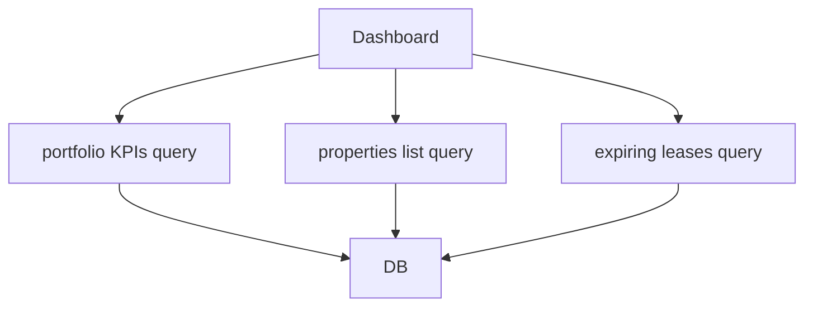

# Epic 1 — Core Property & Unit Management (EPM-14 → EPM-19)

**Updated:** 2026-01-02

## Shared domain spec (Epic 1)

### Core entities
- `Property` (managed by a user in Option A)
- `Unit` (belongs to property)
- `Lease` drives `Unit.status` transitions (occupied/vacant)

### Core queries
- property list (with counts and revenue rollups)
- property detail (units + active leases + recent expenses + inspections)
- units list for a property

### UI routes (current)
- `/app/properties` (`src/routes/app.properties.index.tsx`)
- `/app/properties/new` (`src/routes/app.properties.new.tsx`)
- `/app/properties/$propertyId` (`src/routes/app.properties.$propertyId.tsx` + subroutes)

---

## EPM-17 — Add New Property

### Goal
Allow a manager to create a new property and persist it with correct validation and optional geocoding.

### API surface (current + required)
- Existing:
  - `createProperty` in `src/services/properties.api.ts`
  - Zod schema in `src/services/properties.schema.ts`
- Required enhancements:
  - address validation integration (EPM-3)
  - duplicate address detection (DB constraint or query)

### API endpoints (exact)
- **Server functions (TanStack Start)** — `src/services/properties.api.ts`
  - `createProperty` (`method: 'POST'`) — create a property; server derives `managerId` from auth context
  - `getProperties` (`method: 'GET'`) — used for post-create redirect/list refresh
  - `getProperty` (`method: 'GET'`) — used for post-create redirect to detail

### Zod schemas (exact)
- **File**: `src/services/properties.schema.ts`
- **Exports used by `createProperty`**:

```ts
export const createPropertySchema = z.object({
  name: z.string().min(1, 'Property name is required'),
  type: propertyTypeEnum.default('MULTI_FAMILY'),
  status: propertyStatusEnum.default('ACTIVE'),

  // Address
  addressLine1: z.string().min(1, 'Address is required'),
  addressLine2: z.string().optional(),
  city: z.string().min(1, 'City is required'),
  state: z.string().default('MN'),
  zipCode: z.string().min(5, 'Valid zip code required'),
  country: z.string().default('US'),
  latitude: z.number().optional(),
  longitude: z.number().optional(),

  // Property Details
  yearBuilt: z.number().int().min(1800).max(2100).optional(),
  totalUnits: z.number().int().min(1).default(1),
  totalSqFt: z.number().int().positive().optional(),
  lotSize: z.number().positive().optional(),
  parkingSpaces: z.number().int().min(0).optional(),
  amenities: z.array(z.string()).default([]),

  // Compliance
  rentalLicenseNumber: z.string().optional(),
  rentalLicenseExpiry: z.coerce.date().optional(),
  leadPaintDisclosure: z.boolean().default(false),
  builtBefore1978: z.boolean().default(false),

  // Financial
  purchasePrice: z.number().positive().optional(),
  purchaseDate: z.coerce.date().optional(),
  currentValue: z.number().positive().optional(),
  mortgageBalance: z.number().min(0).optional(),

  // Metadata
  notes: z.string().optional(),
  imageUrl: z.string().url().optional(),
})
```

### DB DDL/migrations (exact)
- **Existing (current)**: `supabase/migrations/001_initial_schema.sql`

```sql
CREATE TABLE properties (
  id UUID PRIMARY KEY DEFAULT gen_random_uuid(),
  name TEXT NOT NULL,
  type property_type DEFAULT 'MULTI_FAMILY',
  status property_status DEFAULT 'ACTIVE',

  -- Address
  address_line1 TEXT NOT NULL,
  address_line2 TEXT,
  city TEXT NOT NULL,
  state TEXT DEFAULT 'MN',
  zip_code TEXT NOT NULL,
  country TEXT DEFAULT 'US',
  latitude DECIMAL(10, 8),
  longitude DECIMAL(11, 8),

  -- Property Details
  year_built INTEGER,
  total_units INTEGER DEFAULT 1,
  total_sq_ft INTEGER,
  lot_size DECIMAL(10, 2),
  parking_spaces INTEGER,
  amenities TEXT[] DEFAULT '{}',

  -- Compliance
  rental_license_number TEXT,
  rental_license_expiry TIMESTAMPTZ,
  lead_paint_disclosure BOOLEAN DEFAULT FALSE,
  built_before_1978 BOOLEAN DEFAULT FALSE,

  -- Financial
  purchase_price DECIMAL(12, 2),
  purchase_date TIMESTAMPTZ,
  current_value DECIMAL(12, 2),
  mortgage_balance DECIMAL(12, 2),

  -- Metadata
  notes TEXT,
  image_url TEXT,
  created_at TIMESTAMPTZ DEFAULT NOW(),
  updated_at TIMESTAMPTZ DEFAULT NOW(),

  -- Relations
  manager_id UUID NOT NULL REFERENCES users(id)
);
```

- **Optional (recommended) follow-up migration for duplicate address detection** (new migration file, not yet applied):

```sql
-- 00X_properties_unique_address_per_manager.sql
CREATE UNIQUE INDEX IF NOT EXISTS idx_properties_unique_address_per_manager
  ON properties(manager_id, address_line1, city, state, zip_code);
```

### UI spec
Form sections:
- Basic: name, type, totalUnits, yearBuilt
- Address: line1, line2, city, state, zip
- Optional: amenities, notes

Submission:
- optimistic UI: show “creating…”
- on success: redirect to property detail

Validation rules
- name required
- addressLine1/city/state/zip required
- zip format (US)
- totalUnits >= 1

### Permissions
- Only authenticated user can create
- `managerId` is always set from auth context (never user-provided)

### Test plan
- unit: schema validation
- integration: create property and ensure managerId matches current user

---

## EPM-14 — View Property Portfolio Dashboard

### Goal
Show portfolio-level KPIs and property list with filters.

### KPI definitions (MVP)
- total properties
- total units
- occupancy rate
- total monthly rent (active leases or occupied units currentRent/marketRent)
- open work orders count
- leases expiring within 30/60/90 days

### API surface
- Existing:
  - `getPropertyStats` in `src/services/properties.api.ts`
- Needed:
  - `getPortfolioKpis({ range })`
  - `getExpiringLeases({ days })` (note: current implementation returns fixed 30/60/90 sets; see “exact endpoints” below)

### API endpoints (exact)
- **Server functions (TanStack Start)**
  - `src/services/properties.api.ts`
    - `getPropertyStats` (`method: 'GET'`)
    - `getProperties` (`method: 'GET'`) — the paginated property list feeding the dashboard
  - `src/services/leases.api.ts`
    - `getExpiringLeases` (`method: 'GET'`) — returns fixed `within30Days/within60Days/within90Days` (no params)

### Zod schemas (exact)
- **Property list & filters** — `src/services/properties.schema.ts`
  - `propertyFiltersSchema`
  - `propertyStatusEnum`, `propertyTypeEnum`
- **Lease “expiring within” UI (optional list page)** — `src/services/leases.schema.ts`
  - `leaseFiltersSchema` (supports `expiringWithinDays`)

### DB DDL/migrations (exact)
- **Reads from** (existing): `supabase/migrations/001_initial_schema.sql`
  - `properties` (manager-scoped)
  - `units` (occupancy + rent rollups)
  - `leases` (expiring leases)
  - future: `maintenance_requests` (open work orders KPI)
- **No new migrations required** for current `getPropertyStats` / `getExpiringLeases` implementation.

### UI spec
Dashboard sections:
- KPI cards
- urgent items list
- charts (optional; existing UI has placeholder charts)

### Performance
- must load in <2s for 50+ properties
- use pagination + caching (EPM-5)



---

## EPM-15 — Add Units to Property

### Goal
Allow single and bulk creation of units for a property.

### API surface (required)
- Existing:
  - unit service endpoints (`src/services/units.*`)
- Needed:
  - `createUnit({ propertyId, unitNumber, beds, baths, marketRent, ... })`
  - `bulkCreateUnits({ propertyId, pattern, start, end, defaults })`

### API endpoints (exact)
- **Server functions (TanStack Start)** — `src/services/units.api.ts`
  - `createUnit` (`method: 'POST'`)
  - `bulkCreateUnits` (`method: 'POST'`)
  - `getUnits` (`method: 'GET'`)

### Zod schemas (exact)
- **File**: `src/services/units.schema.ts`
  - `createUnitSchema`
  - `bulkCreateUnitsSchema`
  - `unitIdSchema`, `unitFiltersSchema`
  - `unitStatusEnum`

### DB DDL/migrations (exact)
- **Existing (current)**: `supabase/migrations/001_initial_schema.sql`

```sql
CREATE TABLE units (
  id UUID PRIMARY KEY DEFAULT gen_random_uuid(),
  unit_number TEXT NOT NULL,
  status unit_status DEFAULT 'VACANT',

  -- Unit Details
  floor_plan TEXT,
  bedrooms INTEGER DEFAULT 1,
  bathrooms DECIMAL(2, 1) DEFAULT 1,
  sq_ft INTEGER,
  floor INTEGER,

  -- Rent Information
  market_rent DECIMAL(10, 2) NOT NULL,
  current_rent DECIMAL(10, 2),
  deposit_amount DECIMAL(10, 2),

  -- Features
  features TEXT[] DEFAULT '{}',
  pet_friendly BOOLEAN DEFAULT FALSE,
  pet_deposit DECIMAL(10, 2),
  pet_rent DECIMAL(10, 2),

  -- Appliances & Utilities
  appliances TEXT[] DEFAULT '{}',
  utilities_included TEXT[] DEFAULT '{}',

  -- Metadata
  notes TEXT,
  image_urls TEXT[] DEFAULT '{}',
  created_at TIMESTAMPTZ DEFAULT NOW(),
  updated_at TIMESTAMPTZ DEFAULT NOW(),

  -- Relations
  property_id UUID NOT NULL REFERENCES properties(id) ON DELETE CASCADE,

  UNIQUE(property_id, unit_number)
);
```

- **No new migrations required** for single/bulk unit creation (MVP).

### Bulk patterns
- numeric range: `101`–`110`
- prefix + range: `A-1`–`A-10` (optional)

### Validation
- enforce uniqueness: `(propertyId, unitNumber)` unique
- marketRent required

### UI spec
- “Add Unit” form
- “Bulk Add” drawer/modal with preview of units to be created

### Test plan
- integration: bulk insert + uniqueness failure

---

## EPM-16 — Edit Property/Unit Details

### Goal
Edit forms with prefill, validation, and audit trail.

### API surface
- Existing:
  - `updateProperty` in properties service
  - expected `updateUnit` in units service
- Needed:
  - “change tracking” (diff) returned to UI
  - audit log writes (EPM-71)

### API endpoints (exact)
- **Server functions (TanStack Start)**
  - `src/services/properties.api.ts`
    - `updateProperty` (`method: 'POST'`)
  - `src/services/units.api.ts`
    - `updateUnit` (`method: 'POST'`)

### Zod schemas (exact)
- **Property update** — `src/services/properties.schema.ts`
  - `updatePropertySchema` (derived from `createPropertySchema.partial()`)
  - `propertyIdSchema` (merged with update schema in the server fn validator)
- **Unit update** — `src/services/units.schema.ts`
  - `updateUnitSchema` (partial, omits `propertyId`)
  - `unitIdSchema`

### DB DDL/migrations (exact)
- **Existing tables**: `properties`, `units` (`supabase/migrations/001_initial_schema.sql`)
- **No new migrations required** for basic edit flows.
- **Planned follow-up (EPM-71)**: audit writes on update (schema already includes `audit_logs`; wiring still pending).

### UI spec
- edit pages or modal edit flows
- optimistic update (TanStack Query mutate + rollback on error)

---

## EPM-19 — View Unit Availability Status

### Goal
Status badges + filters, driven by unit status and lease lifecycle.

### Status mapping (MVP)
- `VACANT` (default)
- `OCCUPIED` when there is an ACTIVE lease
- `NOTICE_GIVEN` if flagged (manual for MVP)
- `UNDER_RENOVATION` manual
- `OFF_MARKET` manual

### Automation spec
- On lease activation: set unit status to OCCUPIED
- On lease termination/expiration: set to VACANT (unless overridden)

### API endpoints (exact)
- **Server functions (TanStack Start)**
  - `src/services/units.api.ts`
    - `getUnits` (`method: 'GET'`) — filter by `status`, `propertyId`, etc.
    - `updateUnit` (`method: 'POST'`) — manual overrides (`UNDER_RENOVATION`, `OFF_MARKET`, etc.)
  - `src/services/leases.api.ts`
    - `createLease` (`method: 'POST'`) — sets unit to `OCCUPIED` when created with status `ACTIVE`
    - `updateLease` (`method: 'POST'`) — sets unit to `VACANT` when lease becomes `TERMINATED`/`EXPIRED`

### Zod schemas (exact)
- **Unit status filtering + update** — `src/services/units.schema.ts`
  - `unitStatusEnum`
  - `unitFiltersSchema`
  - `updateUnitSchema`
- **Lease status driving automation** — `src/services/leases.schema.ts`
  - `leaseStatusEnum`
  - `updateLeaseSchema`

### DB DDL/migrations (exact)
- **Existing (current)**: `supabase/migrations/001_initial_schema.sql`
  - `units.status` (enum `unit_status`)
  - `leases.status` (enum `lease_status`)
  - `leases.unit_id` FK → `units.id`
- **No new migrations required** for current automation (implemented in server fns).

### UI spec
- badges in unit table
- filters by status
- show “vacancy duration” (derived: now - last lease end)

---

## EPM-18 — Property Detail Page

### Goal
Single property overview: units table, tenants, maintenance, financial summary, upcoming expirations.

### API surface
- Existing:
  - `getProperty` in properties service includes units + active leases + expenses + inspections
- Needed:
  - open work orders by unit
  - delinquent tenants list

### API endpoints (exact)
- **Server functions (TanStack Start)**
  - `src/services/properties.api.ts`
    - `getProperty` (`method: 'GET'`) — returns property plus `units` (with active leases + tenant), `expenses`, `inspections`

### Zod schemas (exact)
- **File**: `src/services/properties.schema.ts`
  - `propertyIdSchema` (validator for `getProperty`)

### DB DDL/migrations (exact)
- **Existing tables used by `getProperty` includes**: `properties`, `units`, `leases`, `tenants`, `expenses`, `inspections`
  - Source: `supabase/migrations/001_initial_schema.sql`
- **No new migrations required** for current detail page implementation.

### UI spec
Sections:
- header summary card
- units table (status, rent, tenant)
- recent maintenance
- recent expenses
- inspection history

### Test plan
- integration: property detail returns only scoped property (managerId)

