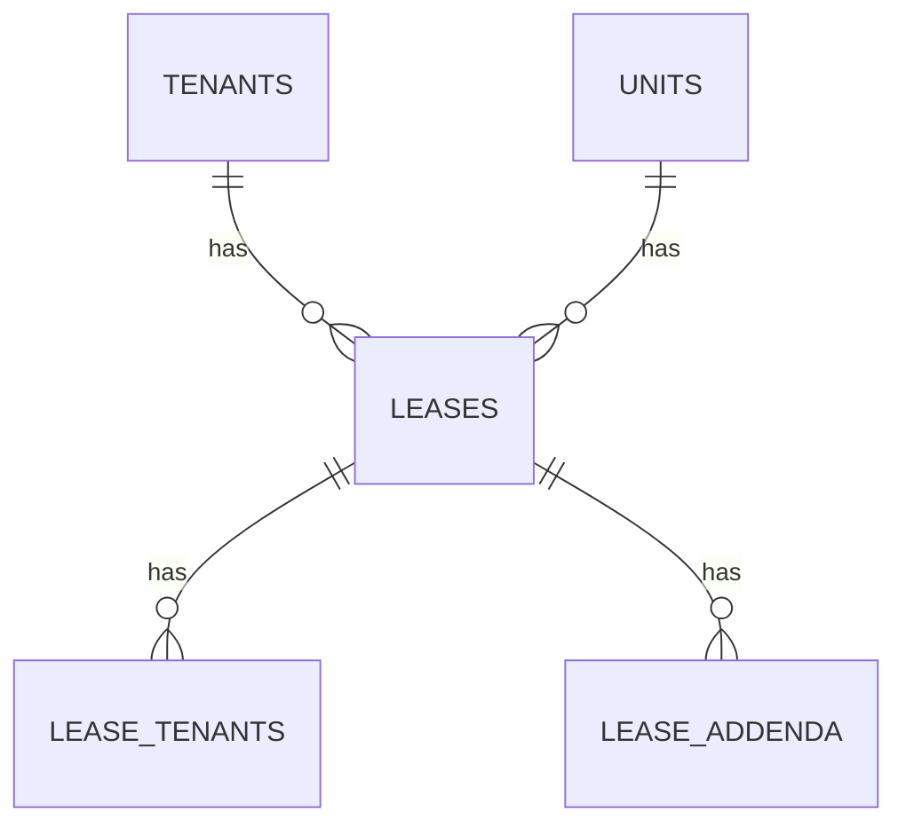
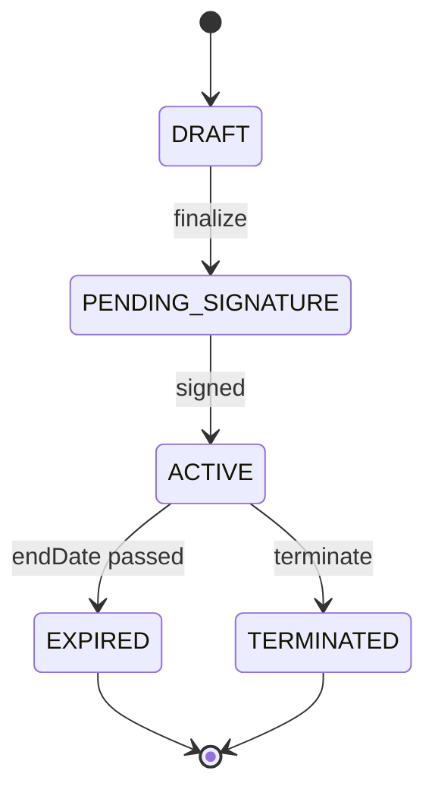

# Epic 2 — Tenant Management & Leasing (EPM-20 → EPM-28)

**Updated:** 2026-01-02

## Shared domain spec (Epic 2)

### Primary goals
- Track tenant profiles and their occupancy via leases
- Make lease lifecycle auditable and operationally safe (no overlapping leases)

### Data model (current)
- `Tenant` has personal info, optional PII fields (SSN/ID)
- `Lease` links `tenantId` + `unitId` and includes rent/deposit rules
- `LeaseTenant` supports co-tenants
- `LeaseAddendum` supports addenda

### Core invariants
- A unit must not have overlapping ACTIVE leases
- A lease must have `startDate < endDate`



---

## EPM-21 — Tenant Profile Creation

### Goal
Create tenant record with contact info, optional additional fields, and secure handling of sensitive data.

### API surface (current)
- `createTenant`, `getTenants`, `getTenant`, `updateTenant`, `deleteTenant` in `src/services/tenants.*`

### API endpoints (exact)
- **Server functions (TanStack Start)** — `src/services/tenants.api.ts`
  - `getTenants` (`method: 'GET'`)
  - `getTenant` (`method: 'GET'`)
  - `createTenant` (`method: 'POST'`)
  - `updateTenant` (`method: 'POST'`)
  - `deleteTenant` (`method: 'POST'`)

### Zod schemas (exact)
- **File**: `src/services/tenants.schema.ts`
  - `tenantStatusEnum`
  - `createTenantSchema`
  - `updateTenantSchema`
  - `tenantFiltersSchema`
  - `tenantIdSchema`

### DB DDL/migrations (exact)
- **Existing (base)**: `supabase/migrations/001_initial_schema.sql`
  - `CREATE TABLE tenants` (line ~291) — includes `email TEXT UNIQUE NOT NULL`
- **No new migrations required** for basic tenant CRUD (MVP).

### Security spec (PII)
- SSN and ID must not be stored in plaintext.
- Option A for MVP:
  - Store only last4 in tenant record
  - Store full docs as encrypted files in Supabase Storage (EPM-2/EPM-44) with restricted download links
- Option B:
  - Field-level encryption (application layer) with envelope keys (future)

### UI spec
- `/app/tenants/new` with validation + optional sections collapsed
- After create: route to tenant detail

### Test plan
- ensure tenant email uniqueness
- ensure restricted fields are not returned to non-privileged roles (once RBAC exists)

---

## EPM-20 — Create New Lease Agreement

### Goal
Create a lease for a unit and tenant with correct validations and financial term capture.

### API surface (current)
- Lease service exists: `src/services/leases.*`

### API endpoints (exact)
- **Server functions (TanStack Start)** — `src/services/leases.api.ts`
  - `getLeases` (`method: 'GET'`)
  - `getLease` (`method: 'GET'`)
  - `createLease` (`method: 'POST'`)
  - `updateLease` (`method: 'POST'`)

### Zod schemas (exact)
- **File**: `src/services/leases.schema.ts`
  - `leaseStatusEnum`, `leaseTypeEnum`
  - `createLeaseSchema`
  - `updateLeaseSchema`
  - `leaseFiltersSchema`
  - `leaseIdSchema`

### DB DDL/migrations (exact)
- **Existing (base)**: `supabase/migrations/001_initial_schema.sql`
  - `CREATE TABLE leases` (line ~357)
  - `CREATE TABLE lease_tenants` (line ~423)
  - `CREATE TABLE lease_addenda` (line ~435)
- **No new migrations required** for lease creation + overlap validation (implemented server-side).

### Required validations
- `startDate < endDate`
- `monthlyRent > 0`
- No overlapping leases for unit:
  - Query for leases where `(start <= newEnd) AND (end >= newStart)` AND status in (ACTIVE, PENDING_SIGNATURE)

### Workflow
1) Select property/unit
2) Select primary tenant + optional co-tenants
3) Set term + rent/deposit + addenda
4) Save as DRAFT or finalize to PENDING_SIGNATURE



### Document generation
Deferred to EPM-43/EPM-68.

### Test plan
- overlapping lease prevention
- lease number generation uniqueness

---

## EPM-22 — Lease Expiration Tracking

### Goal
Surface leases expiring soon (90/60/30 days) and enable action to renew.

### API surface (needed)
- `getExpiringLeases({ days })` returning grouped by window

### API endpoints (exact)
- **Server functions (TanStack Start)** — `src/services/leases.api.ts`
  - `getExpiringLeases` (`method: 'GET'`) — current implementation returns fixed `within30Days/within60Days/within90Days` (no params)

### Zod schemas (exact)
- **N/A** for `getExpiringLeases` (no input payload).

### DB DDL/migrations (exact)
- **Existing (base)**: `supabase/migrations/001_initial_schema.sql`
  - `CREATE TABLE leases` (line ~357)
  - Index: `CREATE INDEX idx_leases_end_date ON leases(end_date);` (line ~420)
- **No new migrations required**.

### UI spec
- Dashboard widget + `/app/leases` filters
- Badge colors:
  - <30: red
  - <60: yellow
  - <90: gray

### Notifications
Deferred to background jobs + email provider (EPM-6 + EPM-4).

---

## EPM-23 — Lease Renewal Workflow

### Goal
Make renewals safe and auditable with status tracking.

### Data model (recommended)
- Option A: add fields to Lease:
  - `renewalStatus` enum
  - `renewedFromLeaseId` (self-reference)
- Option B: separate `lease_renewals` table

### Workflow
- “Renew” action creates a new lease in DRAFT with prefilled values.

### API endpoints (exact)
- **Proposed (TanStack Start)**: `src/services/lease-renewals.api.ts`
  - `createLeaseRenewalFromLease` (`method: 'POST'`) — creates a new lease (DRAFT) linked to prior lease
  - `finalizeLeaseRenewal` (`method: 'POST'`) — transitions to `PENDING_SIGNATURE` and triggers document generation (later)

### Zod schemas (exact)
- **Proposed**: `src/services/lease-renewals.schema.ts`

```ts
import { z } from 'zod'

export const createLeaseRenewalFromLeaseSchema = z.object({
  leaseId: z.string().uuid(),
  startDate: z.coerce.date(),
  endDate: z.coerce.date(),
  monthlyRent: z.number().positive(),
})
```

### DB DDL/migrations (exact)
- **Option A (recommended) — additive columns on `leases`** (new migration, not yet applied):

```sql
-- 00X_leases_renewal_link.sql
ALTER TABLE leases
  ADD COLUMN IF NOT EXISTS renewed_from_lease_id UUID REFERENCES leases(id);

CREATE INDEX IF NOT EXISTS idx_leases_renewed_from
  ON leases(renewed_from_lease_id);
```

---

## EPM-24 — Tenant List & Search

### Goal
Filter and search tenants by name/unit/email/phone and status.

### API spec
- existing filters in tenants service should support:
  - search query
  - property filter (requires joins via leases/units)

### UI spec
- table with pagination + export

### API endpoints (exact)
- **Server functions (TanStack Start)** — `src/services/tenants.api.ts`
  - `getTenants` (`method: 'GET'`) — supports `search`, `status`, `hasActiveLease`, pagination

### Zod schemas (exact)
- **File**: `src/services/tenants.schema.ts`
  - `tenantFiltersSchema`

### DB DDL/migrations (exact)
- **Existing (base)**: `supabase/migrations/001_initial_schema.sql`
  - `tenants` (line ~291), `leases` (line ~357), `units` (line ~245), `properties` (line ~191)
- **No new migrations required** for list/search (MVP).

---

## EPM-25 — Tenant Detail Page

### Goal
Single tenant view: contact info, lease summary, payment history, documents, maintenance.

### API spec
- `getTenantDetail(tenantId)` should include:
  - active lease + unit + property
  - recent payments
  - documents list
  - maintenance requests

### API endpoints (exact)
- **Server functions (TanStack Start)** — `src/services/tenants.api.ts`
  - `getTenant` (`method: 'GET'`) — currently includes leases (+ unit + property), pets, payments, maintenanceRequests, documents

### Zod schemas (exact)
- **File**: `src/services/tenants.schema.ts`
  - `tenantIdSchema`

### DB DDL/migrations (exact)
- **Existing (base)**: `supabase/migrations/001_initial_schema.sql`
  - `tenants` (line ~291)
  - `payments` (line ~623)
  - `maintenance_requests` (line ~549)
  - `documents` (line ~774) + `storage_path` (additive migration `supabase/migrations/002_add_documents_storage_path.sql`)
- **No new migrations required** for the current detail view includes.

---

## EPM-26 — Pet Application & Approval

### Goal
Capture pet application and approval workflow tied to tenant/lease terms.

### Data model
- `Pet` exists and is linked to Tenant.
- Approval status is stored in Pet status enum.

### UI + workflow
- add pet to tenant profile → PENDING
- manager approves/denies → updates fields + optional addendum generation

### API endpoints (exact)
- **Proposed (TanStack Start)**: `src/services/pets.api.ts`
  - `createPet` (`method: 'POST'`)
  - `updatePet` (`method: 'POST'`)
  - `approvePet` (`method: 'POST'`)
  - `denyPet` (`method: 'POST'`)

### Zod schemas (exact)
- **Proposed**: `src/services/pets.schema.ts`

```ts
import { z } from 'zod'

export const petStatusEnum = z.enum(['PENDING', 'APPROVED', 'DENIED', 'REMOVED'])
export const petTypeEnum = z.enum(['DOG', 'CAT', 'BIRD', 'FISH', 'REPTILE', 'OTHER'])

export const createPetSchema = z.object({
  tenantId: z.string().uuid(),
  type: petTypeEnum,
  name: z.string().min(1),
  breed: z.string().optional(),
  weight: z.number().min(0).optional(),
  notes: z.string().optional(),
})
```

### DB DDL/migrations (exact)
- **Existing (base)**: `supabase/migrations/001_initial_schema.sql`
  - `CREATE TABLE pets` (line ~453)
- **No new migrations required** for pet approval state (status enum already exists).

---

## EPM-27 — Move-In Inspection

### Goal
Digital inspection with photos and structured items.

### Data model
- `Inspection` + `InspectionItem` exist.

### Storage dependency
- Photos require EPM-2/EPM-44.

### UI flow
- create inspection (type MOVE_IN)
- add items per room and upload photos
- generate PDF report (future)

### API endpoints (exact)
- **Proposed (TanStack Start)**: `src/services/inspections.api.ts`
  - `createInspection` (`method: 'POST'`)
  - `getInspections` (`method: 'GET'`)
  - `getInspection` (`method: 'GET'`)
  - `addInspectionItem` (`method: 'POST'`)
  - `updateInspectionItem` (`method: 'POST'`)
  - `completeInspection` (`method: 'POST'`)

### Zod schemas (exact)
- **Proposed**: `src/services/inspections.schema.ts`

```ts
import { z } from 'zod'

export const inspectionTypeEnum = z.enum([
  'MOVE_IN',
  'MOVE_OUT',
  'ROUTINE',
  'MAINTENANCE',
  'SAFETY',
  'ANNUAL',
])

export const createInspectionSchema = z.object({
  propertyId: z.string().uuid(),
  leaseId: z.string().uuid().optional(),
  type: inspectionTypeEnum,
  scheduledDate: z.coerce.date(),
})
```

### DB DDL/migrations (exact)
- **Existing (base)**: `supabase/migrations/001_initial_schema.sql`
  - `CREATE TABLE inspections` (line ~811)
  - `CREATE TABLE inspection_items` (line ~842)
- **Storage dependency**: inspection photos should be stored in Supabase Storage (EPM-2/EPM-44), referenced from `inspection_items.photo_urls`.

---

## EPM-28 — Move-Out Process

### Goal
Move-out workflow: schedule inspection, compare conditions, compute damages, produce deposit disposition letter (MN compliance).

### Compliance rules (MN)
- 21-day deadline for disposition
- interest calculation (if applicable)

### Data model needs
- damage line items (recommended table)
- deposit disposition letter record + send status

### API endpoints (exact)
- **Proposed (TanStack Start)**: `src/services/move-out.api.ts`
  - `createMoveOutInspection` (`method: 'POST'`) — creates inspection type `MOVE_OUT`
  - `recordMoveOutDamages` (`method: 'POST'`) — records damage line items
  - `generateDepositDispositionLetter` (`method: 'POST'`) — produces a letter artifact (PDF) and stores metadata
  - `sendDepositDispositionLetter` (`method: 'POST'`) — sends via email provider and updates status

### Zod schemas (exact)
- **Proposed**: `src/services/move-out.schema.ts`

```ts
import { z } from 'zod'

export const damageLineItemSchema = z.object({
  room: z.string().min(1),
  item: z.string().min(1),
  description: z.string().optional(),
  estimatedRepairCost: z.number().min(0),
})

export const recordMoveOutDamagesSchema = z.object({
  inspectionId: z.string().uuid(),
  leaseId: z.string().uuid(),
  items: z.array(damageLineItemSchema).min(1),
})
```

### DB DDL/migrations (exact)
- **Additive tables required (new migrations, not yet applied)**:

```sql
-- 00X_move_out_damage_items.sql
CREATE TABLE IF NOT EXISTS move_out_damage_items (
  id UUID PRIMARY KEY DEFAULT gen_random_uuid(),
  inspection_id UUID NOT NULL REFERENCES inspections(id) ON DELETE CASCADE,
  lease_id UUID NOT NULL REFERENCES leases(id) ON DELETE CASCADE,
  room TEXT NOT NULL,
  item TEXT NOT NULL,
  description TEXT,
  estimated_repair_cost DECIMAL(10, 2) NOT NULL DEFAULT 0,
  created_at TIMESTAMPTZ DEFAULT NOW()
);

CREATE INDEX IF NOT EXISTS idx_move_out_damage_items_inspection
  ON move_out_damage_items(inspection_id);
```

```sql
-- 00X_deposit_disposition_letters.sql
CREATE TABLE IF NOT EXISTS deposit_disposition_letters (
  id UUID PRIMARY KEY DEFAULT gen_random_uuid(),
  lease_id UUID NOT NULL REFERENCES leases(id) ON DELETE CASCADE,
  status TEXT NOT NULL DEFAULT 'DRAFT', -- DRAFT|GENERATED|SENT|FAILED
  document_url TEXT,                   -- signed URL or stored document reference
  sent_at TIMESTAMPTZ,
  delivery_error TEXT,
  created_at TIMESTAMPTZ DEFAULT NOW(),
  updated_at TIMESTAMPTZ DEFAULT NOW()
);

CREATE INDEX IF NOT EXISTS idx_deposit_disposition_letters_lease
  ON deposit_disposition_letters(lease_id);
```

