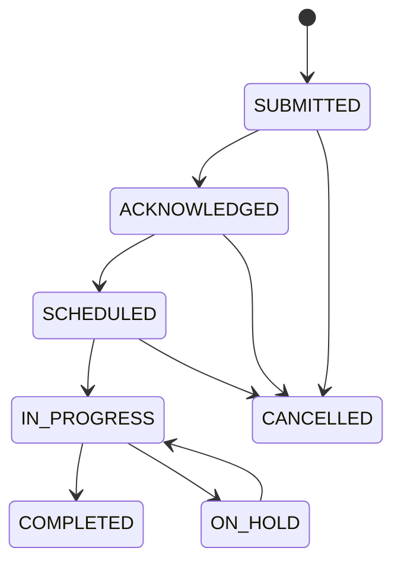

# Epic 3 — Maintenance & Work Orders (EPM-29 → EPM-33, EPM-74 → EPM-76)

**Updated:** 2026-01-02

## Shared domain spec (Epic 3)

### Core entity
`MaintenanceRequest` (aka work order) with:
- status lifecycle
- priority + category
- optional tenant association
- assignment to vendor or staff user

### Status lifecycle (MVP)



### Notifications
- Tenant confirmation on submit
- Vendor email on assignment
- Tenant update on completion

Dependencies: EPM-4 + (for async) EPM-6.

---

## EPM-29 — Tenant Submit Maintenance Request

### Goal
Tenant submits request with optional photos and access preferences.

### UI spec
- Tenant-facing form (MVP can be manager-entered until tenant portal exists)
- Fields: title, description, category, priority, permissionToEnter, preferredTimes, photos

### API spec
- `createMaintenanceRequest`:
  - validates unitId belongs to requesting user’s property scope
  - stores photos (EPM-2/EPM-44)

### API endpoints (exact)
- **Server functions (TanStack Start)** — `src/services/maintenance.api.ts`
  - `createMaintenanceRequest` (`method: 'POST'`)

### Zod schemas (exact)
- **File**: `src/services/maintenance.schema.ts`
  - `createMaintenanceSchema`
  - `maintenanceCategoryEnum`, `maintenancePriorityEnum`, `maintenanceStatusEnum`

### DB DDL/migrations (exact)
- **Existing (base)**: `supabase/migrations/001_initial_schema.sql`
  - `CREATE TABLE maintenance_requests` (line ~549)
  - optional photos today live on `maintenance_requests.photo_urls` (URL strings) — storage backing is EPM-2/EPM-44
- **No new migrations required** for submit flow (MVP).

### Test plan
- unauthorized unit should fail

---

## EPM-30 — Property Manager View Work Orders

### Goal
List work orders with filters and overdue highlighting.

### API spec
- list endpoint with filters: status, priority, category, propertyId, assignedTo

### UI spec
- `/app/maintenance` list page
- row click to detail
- quick stats (open count, overdue count)

### API endpoints (exact)
- **Server functions (TanStack Start)** — `src/services/maintenance.api.ts`
  - `getMaintenanceRequests` (`method: 'GET'`)
  - `getMaintenanceRequest` (`method: 'GET'`)
  - `getMaintenanceStats` (`method: 'GET'`)

### Zod schemas (exact)
- **File**: `src/services/maintenance.schema.ts`
  - `maintenanceFiltersSchema`
  - `maintenanceIdSchema`

### DB DDL/migrations (exact)
- **Existing (base)**: `supabase/migrations/001_initial_schema.sql`
  - `maintenance_requests` (line ~549)
  - `maintenance_comments` (line ~598)
- **No new migrations required**.

---

## EPM-31 — Assign Work Order to Vendor

### Goal
Assign a work order to a vendor with schedule + estimate.

### Dependencies
- Vendor management (EPM-33)
- Email provider (EPM-4)

### Data model
- `MaintenanceRequest.vendorId`
- `scheduledDate`, `scheduledTime`

### Workflow
Manager assigns vendor → system notifies vendor.

### API endpoints (exact)
- **Server functions (TanStack Start)**
  - `src/services/maintenance.api.ts`
    - `updateMaintenanceRequest` (`method: 'POST'`) — sets `vendorId`, `scheduledDate`, `scheduledTime`, `estimatedCost`, etc.
  - (future) `src/services/vendors.api.ts`
    - `getVendors` (`method: 'GET'`) — selection list

### Zod schemas (exact)
- **Maintenance update** — `src/services/maintenance.schema.ts`
  - `updateMaintenanceSchema` (merged with `maintenanceIdSchema` in server fn validator)
- **Vendor selection** — (proposed) `src/services/vendors.schema.ts`

### DB DDL/migrations (exact)
- **Existing (base)**: `supabase/migrations/001_initial_schema.sql`
  - `vendors` (line ~491)
  - `maintenance_requests.vendor_id` FK (line ~549 block)
- **No new migrations required** for assignment (MVP).

---

## EPM-32 — Update Work Order Status

### Goal
Allow status transitions with notes and completion evidence.

### Data model additions (recommended)
- status history table OR event log
  - current schema does not include status history

### UI spec
- status dropdown + notes
- attach completion photos (EPM-2)

### API endpoints (exact)
- **Server functions (TanStack Start)** — `src/services/maintenance.api.ts`
  - `updateMaintenanceRequest` (`method: 'POST'`) — status transitions; auto-sets `completedAt` when `COMPLETED`
  - `addMaintenanceComment` (`method: 'POST'`) — operational notes + internal/private flag

### Zod schemas (exact)
- **File**: `src/services/maintenance.schema.ts`
  - `updateMaintenanceSchema`
  - `addCommentSchema`

### DB DDL/migrations (exact)
- **Existing (base)**: `supabase/migrations/001_initial_schema.sql`
  - `maintenance_requests` (line ~549)
  - `maintenance_comments` (line ~598)
- **Optional follow-up migration** (recommended) for status history (new table, not yet applied):

```sql
-- 00X_maintenance_status_history.sql
CREATE TABLE IF NOT EXISTS maintenance_status_history (
  id UUID PRIMARY KEY DEFAULT gen_random_uuid(),
  request_id UUID NOT NULL REFERENCES maintenance_requests(id) ON DELETE CASCADE,
  from_status maintenance_status,
  to_status maintenance_status NOT NULL,
  changed_by_id UUID REFERENCES users(id),
  changed_at TIMESTAMPTZ DEFAULT NOW(),
  note TEXT
);

CREATE INDEX IF NOT EXISTS idx_maintenance_status_history_request
  ON maintenance_status_history(request_id);
```

---

## EPM-33 — Vendor Management

### Goal
CRUD vendors with categories, rates, insurance/license tracking.

### Data model
Vendor table exists (categories, service areas, insurance fields).

### API spec
- `vendors.*` service (to be implemented)
- filters by category + active status

### UI spec
- `/app/maintenance/vendors` (new route)

### API endpoints (exact)
- **Proposed (TanStack Start)**: `src/services/vendors.api.ts`
  - `getVendors` (`method: 'GET'`)
  - `getVendor` (`method: 'GET'`)
  - `createVendor` (`method: 'POST'`)
  - `updateVendor` (`method: 'POST'`)
  - `deleteVendor` (`method: 'POST'`)

### Zod schemas (exact)
- **Proposed**: `src/services/vendors.schema.ts` (mirrors DB fields + validation rules)

### DB DDL/migrations (exact)
- **Existing (base)**: `supabase/migrations/001_initial_schema.sql`
  - `CREATE TABLE vendors` (line ~491)
- **No new migrations required** for vendor CRUD (MVP).

---

## EPM-74 — Recurring Maintenance Schedules

### Goal
Define recurring templates and auto-generate work orders.

### Dependencies
- Background jobs (EPM-6)

### Data model (recommended)
- `maintenance_schedules` table:
  - recurrence rule (RRULE or simple fields)
  - nextRunAt
  - target scope (property/unit)

### Algorithm
- scheduler runs daily, finds schedules due, creates work orders, advances nextRunAt.

### API endpoints (exact)
- **Proposed (TanStack Start)**: `src/services/maintenance-schedules.api.ts`
  - `createMaintenanceSchedule` (`method: 'POST'`)
  - `getMaintenanceSchedules` (`method: 'GET'`)
  - `updateMaintenanceSchedule` (`method: 'POST'`)
  - `deleteMaintenanceSchedule` (`method: 'POST'`)

### Zod schemas (exact)
- **Proposed**: `src/services/maintenance-schedules.schema.ts`

### DB DDL/migrations (exact)
- **Additive table required** (new migration, not yet applied):

```sql
-- 00X_maintenance_schedules.sql
CREATE TABLE IF NOT EXISTS maintenance_schedules (
  id UUID PRIMARY KEY DEFAULT gen_random_uuid(),
  property_id UUID REFERENCES properties(id) ON DELETE CASCADE,
  unit_id UUID REFERENCES units(id) ON DELETE CASCADE,
  category maintenance_category NOT NULL,
  priority maintenance_priority NOT NULL DEFAULT 'MEDIUM',
  title TEXT NOT NULL,
  description TEXT,
  recurrence_rule TEXT NOT NULL, -- RRULE string or simplified serialized rule
  next_run_at TIMESTAMPTZ NOT NULL,
  is_active BOOLEAN DEFAULT TRUE,
  created_at TIMESTAMPTZ DEFAULT NOW(),
  updated_at TIMESTAMPTZ DEFAULT NOW()
);

CREATE INDEX IF NOT EXISTS idx_maintenance_schedules_next_run
  ON maintenance_schedules(next_run_at);
```

---

## EPM-75 — Emergency Work Order Handling

### Goal
Escalation and response time tracking for emergencies.

### Dependencies
- Notifications (EPM-66) and SMS provider (future)

### Spec
- emergency flag triggers:
  - top-of-queue
  - immediate notifications
  - escalation if unacknowledged within 30 minutes

### API endpoints (exact)
- **Server functions (TanStack Start)** — `src/services/maintenance.api.ts`
  - `updateMaintenanceRequest` (`method: 'POST'`) — set `priority = EMERGENCY`
- **Background jobs (future)** — EPM-6
  - escalation checks + notifications

### Zod schemas (exact)
- **File**: `src/services/maintenance.schema.ts`
  - `maintenancePriorityEnum` (includes `EMERGENCY`)

### DB DDL/migrations (exact)
- **Existing (base)**: `supabase/migrations/001_initial_schema.sql`
  - `maintenance_requests.priority` (part of `maintenance_requests` table, line ~549)
- **No new migrations required** for emergency flagging (MVP).

---

## EPM-76 — Maintenance Cost Tracking

### Goal
Track costs per unit/property and trend over time.

### Current schema
`MaintenanceRequest` includes:
- estimatedCost
- actualCost
- tenantCharge

### Reporting spec
- per-unit totals by month
- per-category totals
- vendor comparison

Dependencies: reporting layer (EPM-72) or dedicated analytics queries.

### API endpoints (exact)
- **Server functions (TanStack Start)** — `src/services/maintenance.api.ts`
  - `getMaintenanceStats` (`method: 'GET'`) — baseline counts; cost reporting endpoints are still needed
- **Proposed (TanStack Start)**: `src/services/maintenance-reports.api.ts`
  - `getMaintenanceCostSummary` (`method: 'GET'`)

### Zod schemas (exact)
- **Existing**: `src/services/maintenance.schema.ts` (filters can be re-used)
- **Proposed**: `src/services/maintenance-reports.schema.ts` (date range + groupBy)

### DB DDL/migrations (exact)
- **Existing (base)**: `supabase/migrations/001_initial_schema.sql`
  - `maintenance_requests` includes `estimated_cost`, `actual_cost`, `tenant_charge` (line ~549 block)
- **No new migrations required** for cost capture (reporting is query work).

