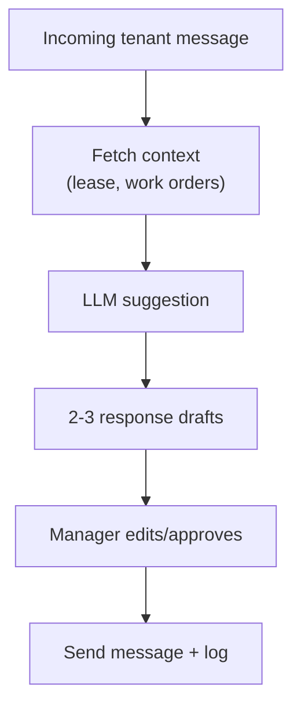

# Epic 6 — Communication Hub (EPM-39 → EPM-42, EPM-65 → EPM-66)

**Updated:** 2026-01-02

## Shared domain spec (Epic 6)

### Entities
- `Message` (instance)
- `MessageTemplate` (reusable)

### Channels (MVP)
- Email only (SMS later)

### Delivery + audit
All sends should write `messages` rows with delivery status and provider ids.

---

## EPM-39 — Send Message to Tenant

### Goal
Compose and send an email to one or more tenants, store it in message log.

### API surface (proposed)
- `messages.api.ts`
  - `sendMessage({ tenantIds[], subject, body, attachments[] })`
  - `listMessages({ filters })`
- Integration:
  - `src/server/email.ts` / SendGrid provider (EPM-4)
  - attachments via storage (EPM-2/EPM-44)

### UI spec
- compose view
- recipient picker
- preview
- send + status

### API endpoints (exact)
- **Proposed (TanStack Start)**: `src/services/messages.api.ts`
  - `sendMessage` (`method: 'POST'`)
  - `listMessages` (`method: 'GET'`)
  - `getMessage` (`method: 'GET'`)
- **Email provider (server utility)**: `src/server/email.ts` (and/or SendGrid provider per EPM-4)
- **Attachments**: Supabase Storage (EPM-2/EPM-44)

### Zod schemas (exact)
- **Proposed**: `src/services/messages.schema.ts`

```ts
import { z } from 'zod'

export const sendMessageSchema = z.object({
  tenantIds: z.array(z.string().uuid()).min(1),
  subject: z.string().min(1).optional(),
  body: z.string().min(1),
  htmlBody: z.string().optional(),
  templateId: z.string().uuid().optional(),
  attachmentDocumentIds: z.array(z.string().uuid()).optional().default([]),
})
```

### DB DDL/migrations (exact)
- **Existing (base)**: `supabase/migrations/001_initial_schema.sql`
  - `CREATE TABLE messages` (line ~737)
  - `messages.sender_id` FK → `users.id`
  - `messages.tenant_id` FK → `tenants.id` (optional)
- **No new migrations required** for outbound log (MVP).

---

## EPM-40 — Message Templates

### Goal
CRUD templates with variables and categories.

### Template engine
- Variables:
  - `{{tenant.firstName}}`, `{{property.name}}`, `{{lease.monthlyRent}}`
- Render:
  - validate variables used vs available
  - HTML sanitize

### Data model
Existing table `message_templates` supports `variables[]`, `category`, `htmlBody`.

### API endpoints (exact)
- **Proposed (TanStack Start)**: `src/services/message-templates.api.ts`
  - `getMessageTemplates` (`method: 'GET'`)
  - `getMessageTemplate` (`method: 'GET'`)
  - `createMessageTemplate` (`method: 'POST'`)
  - `updateMessageTemplate` (`method: 'POST'`)
  - `deleteMessageTemplate` (`method: 'POST'`)

### Zod schemas (exact)
- **Proposed**: `src/services/message-templates.schema.ts`

```ts
import { z } from 'zod'

export const createMessageTemplateSchema = z.object({
  name: z.string().min(1),
  type: z.enum(['EMAIL']).default('EMAIL'),
  subject: z.string().optional(),
  body: z.string().min(1),
  htmlBody: z.string().optional(),
  variables: z.array(z.string()).optional().default([]),
  category: z.string().optional(),
  isActive: z.boolean().optional().default(true),
})
```

### DB DDL/migrations (exact)
- **Existing (base)**: `supabase/migrations/001_initial_schema.sql`
  - `CREATE TABLE message_templates` (line ~715)
- **No new migrations required** for CRUD (MVP).

---

## EPM-41 — Bulk Messaging

### Goal
Send a single message to many recipients with personalization.

### Dependencies
- background jobs (EPM-6)
- delivery tracking (EPM-4)

### Spec
- enqueue per-recipient sends
- provide progress UI (sent/failed)

### API endpoints (exact)
- **Proposed (TanStack Start)**: `src/services/messages-bulk.api.ts`
  - `startBulkSend` (`method: 'POST'`)
  - `getBulkSendStatus` (`method: 'GET'`)
- **Worker**: EPM-6 queue consumes jobs and calls email provider

### Zod schemas (exact)
- **Proposed**: `src/services/messages-bulk.schema.ts` (recipient set + template + personalization)

### DB DDL/migrations (exact)
- **Existing (base)**: `messages` table can store per-recipient sends (line ~737)
- **Optional additive table** (recommended) for bulk send progress (new migration, not yet applied):

```sql
-- 00X_bulk_message_runs.sql
CREATE TABLE IF NOT EXISTS bulk_message_runs (
  id UUID PRIMARY KEY DEFAULT gen_random_uuid(),
  created_by_id UUID NOT NULL REFERENCES users(id),
  status TEXT NOT NULL DEFAULT 'RUNNING', -- RUNNING|COMPLETED|FAILED|CANCELLED
  total_count INTEGER NOT NULL DEFAULT 0,
  sent_count INTEGER NOT NULL DEFAULT 0,
  failed_count INTEGER NOT NULL DEFAULT 0,
  created_at TIMESTAMPTZ DEFAULT NOW(),
  updated_at TIMESTAMPTZ DEFAULT NOW()
);
```

---

## EPM-42 — Communication Dashboard

### Goal
Unified inbox view of messages, filters, search, unread state.

### Data model
Requires:
- inbound messages if we want replies (future)
- for now: outbound log

### API endpoints (exact)
- **Proposed (TanStack Start)**: `src/services/messages.api.ts`
  - `listMessages` (`method: 'GET'`) — filters + search
  - `getMessage` (`method: 'GET'`)

### Zod schemas (exact)
- **Proposed**: `src/services/messages.schema.ts` (filters: status/type/date range/search)

### DB DDL/migrations (exact)
- **Existing (base)**: `supabase/migrations/001_initial_schema.sql`
  - `messages` (line ~737)
- **No new migrations required** for outbound-only dashboard.

---

## EPM-66 — Automated Notifications

### Goal
Trigger-based messages (rent due, lease expiring, maintenance scheduled).

### Dependencies
- templates (EPM-40)
- jobs (EPM-6)
- provider (EPM-4)

### Trigger spec (examples)
- rent due: send N days before dueDay
- lease expiring: 90/60/30 days
- maintenance scheduled: on status transition to SCHEDULED

### API endpoints (exact)
- **Proposed (worker + server functions)**:
  - Queue producer functions:
    - `enqueueNotificationJobs` (internal; called on triggers or cron)
  - Email send/log:
    - `sendMessage` (see EPM-39) or dedicated `sendNotification`

### Zod schemas (exact)
- **Proposed**: `src/services/notifications.schema.ts` (event payloads: leaseExpiring, rentDue, maintenanceScheduled)

### DB DDL/migrations (exact)
- **Existing (base)**:
  - outbound log can use `messages` table (line ~737)
- **Optional additive table** for notification delivery audit (new migration, not yet applied):

```sql
-- 00X_notification_events.sql
CREATE TABLE IF NOT EXISTS notification_events (
  id UUID PRIMARY KEY DEFAULT gen_random_uuid(),
  type TEXT NOT NULL,
  entity_type TEXT,
  entity_id UUID,
  recipient_tenant_id UUID REFERENCES tenants(id),
  message_id UUID REFERENCES messages(id),
  created_at TIMESTAMPTZ DEFAULT NOW()
);
```

---

## EPM-65 — AI Message Assistant (Phase 2)

### Goal
Suggest responses based on context (tenant, lease terms, maintenance history).

### Safety
- require human approval
- redact sensitive data
- store prompt/response audit



### API endpoints (exact)
- **Proposed (Phase 2)**: `src/services/ai-messages.api.ts`
  - `suggestMessageDrafts` (`method: 'POST'`)

### Zod schemas (exact)
- **Proposed**: `src/services/ai-messages.schema.ts`

```ts
import { z } from 'zod'

export const suggestMessageDraftsSchema = z.object({
  tenantId: z.string().uuid(),
  context: z.object({
    leaseId: z.string().uuid().optional(),
    maintenanceRequestId: z.string().uuid().optional(),
  }).optional(),
  messageFromTenant: z.string().min(1),
})
```

### DB DDL/migrations (exact)
- **Existing (base)**: `messages` can store the final approved send (line ~737)
- **Additive audit log recommended** for prompts/responses (new migration, not yet applied):

```sql
-- 00X_ai_message_audit.sql
CREATE TABLE IF NOT EXISTS ai_message_audit (
  id UUID PRIMARY KEY DEFAULT gen_random_uuid(),
  tenant_id UUID REFERENCES tenants(id),
  prompt TEXT NOT NULL,
  response JSONB NOT NULL,
  created_by_id UUID REFERENCES users(id),
  created_at TIMESTAMPTZ DEFAULT NOW()
);
```

