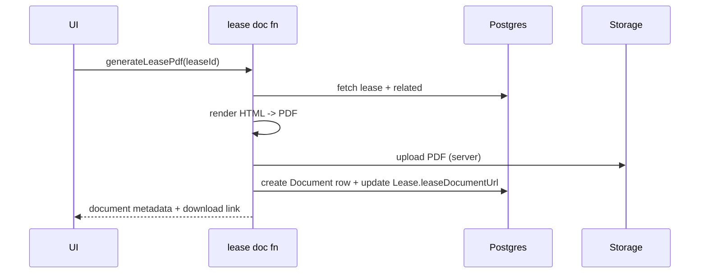

# Epic 8 — Document Management (EPM-43 → EPM-44, EPM-67 → EPM-69)

**Updated:** 2026-01-02

## Shared domain spec (Epic 8)

### Core pillars
1) Storage (Supabase Storage) — EPM-2
2) Metadata (DB `documents`) — EPM-44
3) Generation (lease PDFs, notices) — EPM-43/EPM-67
4) Signatures — EPM-68

### Current implementation snapshot
- Storage helpers exist: `src/server/storage.ts`
- Supabase admin client exists: `src/libs/supabase.ts`
- Documents service exists: `src/services/documents.*`
- Documents UI is being wired: `src/routes/app.documents.tsx`

### Document taxonomy
Use `DocumentType` enum aligned with schema:
- LEASE, ADDENDUM, APPLICATION, ID_DOCUMENT, INCOME_VERIFICATION
- INSPECTION_REPORT, PHOTO, INVOICE, RECEIPT, NOTICE
- CORRESPONDENCE, INSURANCE, LICENSE, OTHER

---

## EPM-44 — Document Upload & Storage

### Goal
Upload and organize documents with metadata and secure access.

### Storage spec (Option A user-scoped)
- Bucket(s): `documents` (and `media` later)
- Path: `user/{userId}/{entity}/{entityId}/{type}/{uuid}-{filename}` (recommended)
- Current code path: `{supabaseUserId}/{folder}/{type}/{uuid}-{filename}`

### Access control
- Server enforces row ownership: `uploaded_by_id = current user`
- Storage policy options:
  - server-mediated only (service role) for MVP
  - later: RLS on `storage.objects` with `auth.uid()` if IDs align

### UI spec
- list documents with filters by type/status/property/tenant
- upload modal
- download action (signed URL)
- delete (soft delete + remove object)

### Search
- MVP: by filename/title (DB `ilike`)
- Future: OCR indexing

### Test plan
- upload allowed types
- reject >25MB
- cannot download other user’s docs

### API endpoints (exact)
- **Storage helpers (server-only)** — `src/server/storage.ts`
  - `createUploadUrl(...)`
  - `createDownloadUrl(...)`
  - `deleteFile(...)`
  - `validateFile(...)`
- **Document server functions (TanStack Start)** — `src/services/documents.api.ts`
  - `getDocuments` (`method: 'GET'`)
  - `getDocument` (`method: 'GET'`)
  - `createDocumentUpload` (`method: 'POST'`)
  - `confirmDocumentUpload` (`method: 'POST'`)
  - `updateDocument` (`method: 'POST'`)
  - `deleteDocument` (`method: 'POST'`)
  - `getDocumentDownloadUrl` (`method: 'GET'`)
  - `getDocumentCounts` (`method: 'GET'`)

### Zod schemas (exact)
- **File**: `src/services/documents.schema.ts`
  - `DocumentType`, `DocumentStatus`
  - `createDocumentUploadSchema`
  - `confirmDocumentUploadSchema`
  - `documentFiltersSchema`
  - `documentIdSchema`
  - `updateDocumentSchema`

### DB DDL/migrations (exact)
- **Base**: `supabase/migrations/001_initial_schema.sql`
  - `CREATE TABLE documents` (line ~774)
- **Additive**: `supabase/migrations/002_add_documents_storage_path.sql`
  - adds `documents.storage_path` (required by `src/services/documents.api.ts`)
- **Prisma mapping (for app types / Prisma usage)**: `prisma/schema.prisma`
  - `model Document` includes `storagePath` mapped to `storage_path`

---

## EPM-43 — Lease Document Generation

### Goal
Generate compliant lease PDFs from templates with variables and addenda selection.

### Template system options
- HTML template + Puppeteer render to PDF
- React Email-like templating + PDF renderer
- docx template fill + convert to PDF

Recommended MVP:
- HTML template + headless renderer to PDF

### Data inputs
- Lease
- Tenant(s)
- Unit + Property
- Addenda
- Compliance flags (lead paint, crime-free addendum)

### Storage
- Store generated PDF in Supabase Storage
- Persist:
  - `Lease.leaseDocumentUrl`
  - `Document` row of type LEASE



### API endpoints (exact)
- **Proposed (TanStack Start)**: `src/services/lease-documents.api.ts`
  - `generateLeasePdf` (`method: 'POST'`)
  - `regenerateLeasePdf` (`method: 'POST'`)
  - `getLeasePdfDownloadUrl` (`method: 'GET'`)

### Zod schemas (exact)
- **Proposed**: `src/services/lease-documents.schema.ts`

```ts
import { z } from 'zod'

export const generateLeasePdfSchema = z.object({
  leaseId: z.string().uuid(),
  addendumIds: z.array(z.string().uuid()).optional().default([]),
})
```

### DB DDL/migrations (exact)
- **Existing (base)**: `supabase/migrations/001_initial_schema.sql`
  - `leases.lease_document_url` and `leases.signed_document_url` (leases table line ~357)
  - `documents` table (line ~774) + `storage_path` (migration `002_add_documents_storage_path.sql`)
- **No new migrations required** for MVP generation (uses existing columns + documents table).

---

## EPM-67 — Document Templates

### Goal
Template library for notices/letters/forms with variables and preview.

### Data model (recommended)
- `document_templates`:
  - name, category, bodyHtml, variables[], version, isActive

### Editor
- Rich text editor with variable insertion
- Preview with sample data

### API endpoints (exact)
- **Proposed (TanStack Start)**: `src/services/document-templates.api.ts`
  - `getDocumentTemplates` (`method: 'GET'`)
  - `getDocumentTemplate` (`method: 'GET'`)
  - `createDocumentTemplate` (`method: 'POST'`)
  - `updateDocumentTemplate` (`method: 'POST'`)
  - `deleteDocumentTemplate` (`method: 'POST'`)

### Zod schemas (exact)
- **Proposed**: `src/services/document-templates.schema.ts`

```ts
import { z } from 'zod'

export const createDocumentTemplateSchema = z.object({
  name: z.string().min(1),
  category: z.string().optional(),
  bodyHtml: z.string().min(1),
  variables: z.array(z.string()).optional().default([]),
  version: z.number().int().min(1).default(1),
  isActive: z.boolean().optional().default(true),
})
```

### DB DDL/migrations (exact)
- **Additive table required** (new migration, not yet applied):

```sql
-- 00X_document_templates.sql
CREATE TABLE IF NOT EXISTS document_templates (
  id UUID PRIMARY KEY DEFAULT gen_random_uuid(),
  name TEXT NOT NULL,
  category TEXT,
  body_html TEXT NOT NULL,
  variables TEXT[] DEFAULT '{}',
  version INTEGER NOT NULL DEFAULT 1,
  is_active BOOLEAN DEFAULT TRUE,
  created_at TIMESTAMPTZ DEFAULT NOW(),
  updated_at TIMESTAMPTZ DEFAULT NOW(),
  UNIQUE(name, version)
);
```

---

## EPM-68 — E-Signature Integration

### Goal
Send generated documents for signature and store executed copies.

### Provider options
- DocuSign / Dropbox Sign / Adobe Sign

### Data model (recommended)
- `sign_requests`:
  - provider, externalId, status, signedAt
  - documentId, leaseId

### API endpoints (exact)
- **Proposed (TanStack Start)**: `src/services/signatures.api.ts`
  - `createSignRequest` (`method: 'POST'`)
  - `getSignRequestStatus` (`method: 'GET'`)
  - `syncSignRequestStatus` (`method: 'POST'`) (webhook-driven preferred)

### Zod schemas (exact)
- **Proposed**: `src/services/signatures.schema.ts`

```ts
import { z } from 'zod'

export const createSignRequestSchema = z.object({
  documentId: z.string().uuid(),
  leaseId: z.string().uuid().optional(),
  provider: z.enum(['DOCUSIGN', 'DROPBOX_SIGN', 'ADOBE_SIGN']),
  signerEmails: z.array(z.string().email()).min(1),
})
```

### DB DDL/migrations (exact)
- **Additive table required** (new migration, not yet applied):

```sql
-- 00X_sign_requests.sql
CREATE TABLE IF NOT EXISTS sign_requests (
  id UUID PRIMARY KEY DEFAULT gen_random_uuid(),
  provider TEXT NOT NULL,
  external_id TEXT,
  status TEXT NOT NULL DEFAULT 'CREATED',
  signed_at TIMESTAMPTZ,
  document_id UUID NOT NULL REFERENCES documents(id) ON DELETE CASCADE,
  lease_id UUID REFERENCES leases(id) ON DELETE SET NULL,
  created_at TIMESTAMPTZ DEFAULT NOW(),
  updated_at TIMESTAMPTZ DEFAULT NOW()
);

CREATE INDEX IF NOT EXISTS idx_sign_requests_document
  ON sign_requests(document_id);
```

---

## EPM-69 — Document Expiration Tracking

### Goal
Track expiring docs (insurance/licenses) and alert 90/60/30 days.

### Dependencies
- background jobs (EPM-6)

### Spec
- `documents.expiresAt` drives alerts
- dashboard widget for upcoming expirations

### API endpoints (exact)
- **Existing**: `src/services/documents.api.ts`
  - `getDocuments` (`method: 'GET'`) — supports filtering by `expiresAt` via additional filters (to be added)
- **Proposed (TanStack Start)**: `src/services/documents-expiration.api.ts`
  - `getExpiringDocuments` (`method: 'GET'`)

### Zod schemas (exact)
- **Existing**: `src/services/documents.schema.ts`
  - `documentFiltersSchema` (extend to include `expiringWithinDays?: number`)
- **Proposed**: `src/services/documents-expiration.schema.ts`

### DB DDL/migrations (exact)
- **Existing (base)**: `supabase/migrations/001_initial_schema.sql`
  - `documents.expires_at` column (documents table line ~774)
- **No new migrations required** (expiration tracking is query + jobs).

