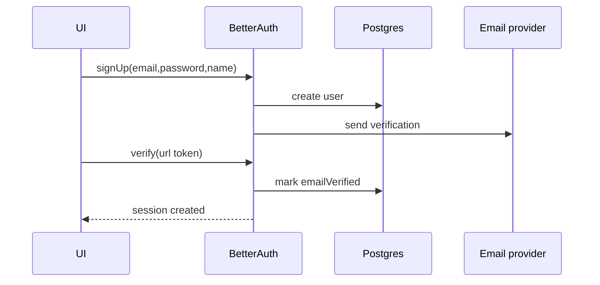

# Epic 11 — User Management & Security (EPM-45 → EPM-46, EPM-70 → EPM-71)

**Updated:** 2026-01-02

## Shared domain spec (Epic 11)

### Goals
- secure authentication + sessions
- authorization (RBAC + per-record access)
- auditability of critical actions
- future: team collaboration

---

## EPM-46 — User Registration & Authentication

### Current repo status
- Better Auth configured (`src/server/auth.ts`)
- Sign-in/sign-up routes exist (`src/routes/auth.*`)
- Email verification is wired via `src/server/email.ts`
- Password reset not implemented

### Auth flows



### Password policy
- enforce min/max (already in auth config)
- require strength rules (uppercase/number/symbol) if desired

### Session model
Decide:
- rolling sessions vs fixed expiry
- auto logout after inactivity (requires client timers + server refresh)

### API endpoints (exact)
- **Auth handler route**: `src/routes/api/auth.$.ts` (Better Auth endpoint integration)
- **Middleware / session context**: `src/middlewares/auth.ts`
- **Server auth config**: `src/server/auth.ts`
- **Auth UI routes**:
  - `src/routes/auth.sign-in.tsx`
  - `src/routes/auth.sign-up.tsx`
  - `src/routes/user.email-verification.tsx`

### Zod schemas (exact)
- **N/A** (auth handled by Better Auth; app-level request schemas not currently exposed via Zod).

### DB DDL/migrations (exact)
- **Existing (base)**: `supabase/migrations/001_initial_schema.sql`
  - `CREATE TABLE users` (line ~127)
  - `CREATE TABLE sessions` (line ~142)
  - `CREATE TABLE accounts` (line ~154)
  - `CREATE TABLE verifications` (line ~178)
- **No new migrations required** for current auth flows.

---

## EPM-45 — Role-Based Access Control (RBAC)

### Current gap
`adminMiddleware` references `Role.Admin` but Role isn’t defined/imported; authorization helpers are missing.

### Role spec
- Admin: full access
- PropertyManager: full CRUD on owned records
- Maintenance: work orders only
- Accountant: financials read/write; others read
- Viewer: read only

### Enforcement points
1) Middleware: coarse route gating
2) Service layer: per-record filters (`where managerId = user.id`)
3) DB policies: RLS (optional, defensive-in-depth)

### Helper APIs (recommended)
- `requireRole(...roles)`
- `requireOwnership(entity, id)`
- `requirePropertyAccess(propertyId)`

### API endpoints (exact)
- **Current enforcement points**
  - middleware: `src/middlewares/auth.ts` (`authedMiddleware`, `adminMiddleware`, `Role`)
  - service-layer scoping: `src/services/*` (e.g. `where: { managerId: context.auth.user.id }`)
- **Proposed helpers**: `src/server/authz.ts`
  - `requireRole(...)`, `requireOwnership(...)`, `requirePropertyAccess(...)`

### Zod schemas (exact)
- **N/A** (RBAC is authorization logic; schemas are unchanged).

### DB DDL/migrations (exact)
- **Existing (base)**: `supabase/migrations/001_initial_schema.sql`
  - RBAC in MVP is enforced by server logic (not DB), so no role tables required.
- **Optional future**:
  - add `users.role` enum column (if not already present in Prisma/DB) and/or team roles (EPM-70)

---

## EPM-70 — Team Collaboration (Phase 2)

### Note
Teams are not yet implemented; Option A user-scoping is current.

### Target model
- `teams`
- `team_members`
- invitations

### Migration plan
- Add team tables
- Backfill: create a default team per user; set ownership relationships
- Update all scoping from `userId` to `teamId`

### API endpoints (exact)
- **Proposed (Phase 2)**: `src/services/teams.api.ts`
  - `createTeam` (`method: 'POST'`)
  - `inviteTeamMember` (`method: 'POST'`)
  - `acceptInvitation` (`method: 'POST'`)
  - `getTeam` (`method: 'GET'`)
  - `listTeamMembers` (`method: 'GET'`)

### Zod schemas (exact)
- **Proposed**: `src/services/teams.schema.ts`

```ts
import { z } from 'zod'

export const createTeamSchema = z.object({
  name: z.string().min(1),
})
```

### DB DDL/migrations (exact)
- **Additive tables required** (new migrations, not yet applied):

```sql
-- 00X_teams.sql
CREATE TABLE IF NOT EXISTS teams (
  id UUID PRIMARY KEY DEFAULT gen_random_uuid(),
  name TEXT NOT NULL,
  created_by_id UUID NOT NULL REFERENCES users(id),
  created_at TIMESTAMPTZ DEFAULT NOW()
);
```

```sql
-- 00X_team_members.sql
CREATE TABLE IF NOT EXISTS team_members (
  id UUID PRIMARY KEY DEFAULT gen_random_uuid(),
  team_id UUID NOT NULL REFERENCES teams(id) ON DELETE CASCADE,
  user_id UUID NOT NULL REFERENCES users(id) ON DELETE CASCADE,
  role TEXT NOT NULL DEFAULT 'MEMBER', -- OWNER|ADMIN|MEMBER
  created_at TIMESTAMPTZ DEFAULT NOW(),
  UNIQUE(team_id, user_id)
);

CREATE INDEX IF NOT EXISTS idx_team_members_user
  ON team_members(user_id);
```

---

## EPM-71 — Audit Trail (Phase 2)

### Current status
`audit_logs` table exists but writes are not implemented.

### Events to log
- create/update/delete on: properties, units, tenants, leases, payments, expenses, documents
- security events: login, password/email change, role changes

### Middleware approach
Wrap server functions:
- capture user, entity type/id, oldValues/newValues (diff), request metadata (ip/userAgent if available)

### UI spec
- `/admin/audit` list view with filters

### API endpoints (exact)
- **Proposed write helper**: `src/server/audit.ts`
  - `writeAuditLog({ entityType, entityId, action, oldValues, newValues, userId, metadata })`
- **Proposed (Phase 2) admin read endpoint**: `src/services/audit.api.ts`
  - `getAuditLogs` (`method: 'GET'`)

### Zod schemas (exact)
- **Proposed**: `src/services/audit.schema.ts` (filters: entityType/entityId/date range/userId)

### DB DDL/migrations (exact)
- **Existing (base)**: `supabase/migrations/001_initial_schema.sql`
  - `CREATE TABLE audit_logs` (line ~875)
- **No new migrations required** (writes are implementation work).

