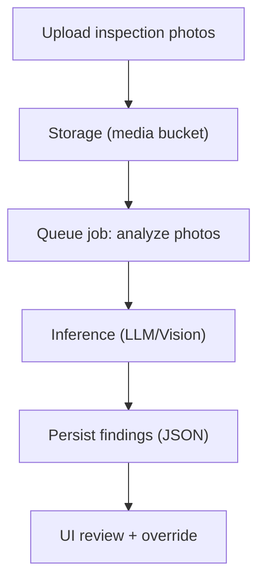

# Phase 2 — AI, Compliance, Analytics, Mobile (EPM-47 → EPM-66)

**Updated:** 2026-01-02

This file contains Phase 2 specifications. Many of these depend on solid MVP data capture (documents, inspections, maintenance, payments).

## Epic 5 — AI-Powered Inspections (EPM-47 → EPM-50)

### Shared AI architecture



#### Data model
- `Inspection.aiAnalysisRun` boolean
- `Inspection.aiFindings` JSON
- `Inspection.aiConfidence` decimal

#### Observability
- store prompt inputs metadata (redacted)
- store model/version
- capture latency + cost

---

### EPM-48 — AI Photo Analysis for Inspections

**Goal:** detect common issues (water damage/mold/pests/cleanliness/damage) per photo with confidence and annotations.

**Pipeline spec:**
- Preprocess:
  - validate image types
  - resize/compress for inference
- Inference:
  - per-image detection -> list of findings
  - each finding: category, confidence, bounding boxes (optional), narrative
- Postprocess:
  - aggregate per inspection
  - compute severity ranking

**UI spec:**
- gallery view with overlays
- “dismiss false positive”
- “override category/severity”

#### API endpoints (exact)
- **Proposed (Phase 2)**: `src/services/ai-inspections.api.ts`
  - `enqueueInspectionPhotoAnalysis` (`method: 'POST'`)
  - `getInspectionAiFindings` (`method: 'GET'`)
  - `updateInspectionAiOverrides` (`method: 'POST'`)

#### Zod schemas (exact)
- **Proposed**: `src/services/ai-inspections.schema.ts` (inspectionId + photoUrls + model selection + overrides)

#### DB DDL/migrations (exact)
- **Existing (base)**: `supabase/migrations/001_initial_schema.sql`
  - `inspections.ai_findings`, `inspections.ai_confidence`, `inspections.ai_analysis_run` (inspections table line ~811)
- **No new migrations required** for storing findings (MVP Phase 2 uses existing JSONB fields).

---

### EPM-47 — Automated Violation Detection

**Goal:** infer lease/compliance violations (unauthorized pets, clutter/hoarding, unauthorized occupants).

**Spec:**
- Requires linking findings to lease clauses
- Generates draft notice templates (ties to EPM-67)

#### API endpoints (exact)
- **Proposed**: `src/services/ai-violations.api.ts`
  - `detectViolations` (`method: 'POST'`)
  - `generateViolationNoticeDraft` (`method: 'POST'`)

#### Zod schemas (exact)
- **Proposed**: `src/services/ai-violations.schema.ts` (inspectionId/leaseId + violation types + draft notice options)

#### DB DDL/migrations (exact)
- **Uses existing**: `inspections` (line ~811), `leases` (line ~357), `document_templates` (proposed in EPM-67)
- **Optional additive table** (recommended) to persist detected violations (new migration, not yet applied):

```sql
-- 00X_detected_violations.sql
CREATE TABLE IF NOT EXISTS detected_violations (
  id UUID PRIMARY KEY DEFAULT gen_random_uuid(),
  inspection_id UUID REFERENCES inspections(id) ON DELETE CASCADE,
  lease_id UUID REFERENCES leases(id) ON DELETE CASCADE,
  category TEXT NOT NULL,
  confidence DECIMAL(3, 2),
  details JSONB,
  created_at TIMESTAMPTZ DEFAULT NOW()
);
```

---

### EPM-49 — Predictive Maintenance Alerts

**Goal:** predict failures from historical patterns (HVAC age, recurring leaks).

**Data requirements:**
- equipment inventory (new tables)
- maintenance history
- inspection history

**Output:**
- probability 0–100
- ETA bucket (30/60/90)
- recommended action

#### API endpoints (exact)
- **Proposed**: `src/services/predictive-maintenance.api.ts`
  - `getPredictiveMaintenanceAlerts` (`method: 'GET'`)
  - `enqueuePredictiveMaintenanceRun` (`method: 'POST'`)

#### Zod schemas (exact)
- **Proposed**: `src/services/predictive-maintenance.schema.ts` (filters: propertyId/unitId + time window)

#### DB DDL/migrations (exact)
- **Requires additive tables** for equipment inventory (new migrations, not yet applied):

```sql
-- 00X_equipment_inventory.sql
CREATE TABLE IF NOT EXISTS equipment (
  id UUID PRIMARY KEY DEFAULT gen_random_uuid(),
  property_id UUID NOT NULL REFERENCES properties(id) ON DELETE CASCADE,
  unit_id UUID REFERENCES units(id) ON DELETE SET NULL,
  type TEXT NOT NULL,       -- HVAC|WATER_HEATER|APPLIANCE|OTHER
  model TEXT,
  installed_at DATE,
  metadata JSONB,
  created_at TIMESTAMPTZ DEFAULT NOW()
);
```

---

### EPM-50 — AI Inspection Report Generation

**Goal:** create structured report from photos + findings.

**Output:**
- summary
- issues by severity
- recommendations
- annotated photos

**Export:**
- PDF + attach to tenant

#### API endpoints (exact)
- **Proposed**: `src/services/ai-inspection-reports.api.ts`
  - `generateInspectionReport` (`method: 'POST'`)

#### Zod schemas (exact)
- **Proposed**: `src/services/ai-inspection-reports.schema.ts` (inspectionId + includePhotos + templateId?)

#### DB DDL/migrations (exact)
- **Uses existing**: `inspections`, `inspection_items` (lines ~811/~842), `documents` (line ~774)
- **Storage**: Supabase Storage (EPM-2/EPM-44) for PDF artifact; metadata stored in `documents`.

---

## Epic 7 — Compliance & Legal (EPM-51 → EPM-56)

### Shared compliance approach
- encode rules as queries + validators
- generate required documents (templates)
- track acknowledgements

---

### EPM-51 — Compliance Dashboard

**Goal:** show compliance status by jurisdiction, property, requirement.

**Model (recommended):**
- `compliance_requirements` (static)
- `compliance_status` (per property)

#### API endpoints (exact)
- **Proposed**: `src/services/compliance.api.ts`
  - `getComplianceDashboard` (`method: 'GET'`)

#### Zod schemas (exact)
- **Proposed**: `src/services/compliance.schema.ts` (filters: jurisdiction/propertyId)

#### DB DDL/migrations (exact)
- **Additive tables required** (new migrations, not yet applied):

```sql
-- 00X_compliance_requirements.sql
CREATE TABLE IF NOT EXISTS compliance_requirements (
  id UUID PRIMARY KEY DEFAULT gen_random_uuid(),
  jurisdiction TEXT NOT NULL,
  code TEXT NOT NULL,
  name TEXT NOT NULL,
  description TEXT,
  created_at TIMESTAMPTZ DEFAULT NOW(),
  UNIQUE(jurisdiction, code)
);
```

```sql
-- 00X_compliance_status.sql
CREATE TABLE IF NOT EXISTS compliance_status (
  id UUID PRIMARY KEY DEFAULT gen_random_uuid(),
  property_id UUID NOT NULL REFERENCES properties(id) ON DELETE CASCADE,
  requirement_id UUID NOT NULL REFERENCES compliance_requirements(id) ON DELETE CASCADE,
  status TEXT NOT NULL DEFAULT 'UNKNOWN', -- UNKNOWN|COMPLIANT|NON_COMPLIANT
  due_at TIMESTAMPTZ,
  evidence_document_id UUID REFERENCES documents(id),
  updated_at TIMESTAMPTZ DEFAULT NOW(),
  UNIQUE(property_id, requirement_id)
);
```

---

### EPM-53 — Security Deposit Interest Compliance

Depends on deposit model decision (lease fields vs separate table) + background jobs.

#### API endpoints (exact)
- **Proposed**: `src/services/deposits-compliance.api.ts`
  - `getDepositInterestAccruals` (`method: 'GET'`)
  - `enqueueDepositInterestAccrualJob` (`method: 'POST'`)

#### Zod schemas (exact)
- **Proposed**: `src/services/deposits-compliance.schema.ts` (date range + lease/property filters)

#### DB DDL/migrations (exact)
- **Depends on** the deposit tables introduced in Epic 4 (EPM-36) and move-out (EPM-28).

---

### EPM-52 — Lead Paint Disclosure Compliance

**Goal:** enforce disclosures for pre-1978 properties.

**Spec:**
- property flag `builtBefore1978` triggers:
  - mandatory addendum on lease generation
  - tenant acknowledgement record
  - block finalization without acknowledgement

#### API endpoints (exact)
- **Proposed**: `src/services/compliance-lead-paint.api.ts`
  - `getLeadPaintRequirementStatus` (`method: 'GET'`)
  - `acknowledgeLeadPaintDisclosure` (`method: 'POST'`)

#### Zod schemas (exact)
- **Proposed**: `src/services/compliance-lead-paint.schema.ts`

#### DB DDL/migrations (exact)
- **Uses existing**: `properties.built_before_1978` (properties table line ~191) and `documents`
- **Additive acknowledgements table recommended** (new migration, not yet applied):

```sql
-- 00X_disclosure_acknowledgements.sql
CREATE TABLE IF NOT EXISTS disclosure_acknowledgements (
  id UUID PRIMARY KEY DEFAULT gen_random_uuid(),
  lease_id UUID REFERENCES leases(id) ON DELETE CASCADE,
  tenant_id UUID REFERENCES tenants(id) ON DELETE CASCADE,
  type TEXT NOT NULL, -- LEAD_PAINT|CRIME_FREE|OTHER
  acknowledged_at TIMESTAMPTZ DEFAULT NOW(),
  document_id UUID REFERENCES documents(id)
);
```

---

### EPM-55 — Rental License Tracking

**Goal:** record license numbers/expiry; alert before expiry; attach docs.

**Depends on:** documents + jobs.

#### API endpoints (exact)
- **Proposed**: `src/services/rental-licenses.api.ts`
  - `getExpiringLicenses` (`method: 'GET'`)
  - `updatePropertyLicenseInfo` (`method: 'POST'`)

#### Zod schemas (exact)
- **Existing**: `src/services/properties.schema.ts` includes:
  - `rentalLicenseNumber`, `rentalLicenseExpiry`

#### DB DDL/migrations (exact)
- **Existing**: `properties.rental_license_number`, `properties.rental_license_expiry` (properties table line ~191)
- **No new migrations required**.

---

### EPM-54 — Crime-Free Housing Compliance

**Goal:** ensure addendum and certification tracking.

#### API endpoints (exact)
- **Proposed**: `src/services/compliance-crime-free.api.ts`
  - `getCrimeFreeStatus` (`method: 'GET'`)
  - `acknowledgeCrimeFreeAddendum` (`method: 'POST'`)

#### Zod schemas (exact)
- **Proposed**: `src/services/compliance-crime-free.schema.ts`

#### DB DDL/migrations (exact)
- **Uses** the shared `disclosure_acknowledgements` table proposed in EPM-52.

---

### EPM-56 — Fair Housing Compliance Checks

**Goal:** ensure screening/application forms and communications do not violate fair housing rules.

**Spec:**
- form schema review
- message content flagging (ties to AI assistant)
- audit trail

#### API endpoints (exact)
- **Proposed**: `src/services/compliance-fair-housing.api.ts`
  - `analyzeMessageForFairHousingRisk` (`method: 'POST'`)

#### Zod schemas (exact)
- **Proposed**: `src/services/compliance-fair-housing.schema.ts`

#### DB DDL/migrations (exact)
- **Optional additive audit**: use `ai_message_audit` (proposed in EPM-65) + `audit_logs` (line ~875)

---

## Epic 9 — Reporting & Analytics (EPM-57 → EPM-60)

### Shared analytics model
- build aggregation queries first
- then dashboards
- caching layer helps (EPM-5)

---

### EPM-57 — Property Performance Dashboard

KPIs:
- occupancy rate
- collection rate
- NOI (revenue - expenses)
- maintenance cost ratio

#### API endpoints (exact)
- **Proposed**: `src/services/analytics-property.api.ts`
  - `getPropertyPerformance` (`method: 'GET'`)

#### Zod schemas (exact)
- **Proposed**: `src/services/analytics-property.schema.ts` (date range + propertyId)

#### DB DDL/migrations (exact)
- **Uses existing**: `leases`, `payments`, `expenses`, `maintenance_requests` (all in `001_initial_schema.sql`)

---

### EPM-58 — Custom Report Builder

**Spec:**
- select fields
- filters
- grouping
- chart type
- saved reports

**Model (recommended):**
- `saved_reports` with JSON config

#### API endpoints (exact)
- **Proposed**: `src/services/saved-reports.api.ts`
  - `createSavedReport` (`method: 'POST'`)
  - `getSavedReports` (`method: 'GET'`)
  - `runSavedReport` (`method: 'GET'`)

#### Zod schemas (exact)
- **Proposed**: `src/services/saved-reports.schema.ts`

#### DB DDL/migrations (exact)
- **Additive table required** (new migration, not yet applied):

```sql
-- 00X_saved_reports.sql
CREATE TABLE IF NOT EXISTS saved_reports (
  id UUID PRIMARY KEY DEFAULT gen_random_uuid(),
  created_by_id UUID NOT NULL REFERENCES users(id),
  name TEXT NOT NULL,
  config JSONB NOT NULL,
  created_at TIMESTAMPTZ DEFAULT NOW(),
  updated_at TIMESTAMPTZ DEFAULT NOW()
);
```

---

### EPM-59 — Tenant Analytics

Metrics:
- average lease duration
- renewal rate
- early termination rate
- on-time payment %

#### API endpoints (exact)
- **Proposed**: `src/services/analytics-tenants.api.ts`
  - `getTenantAnalytics` (`method: 'GET'`)

#### Zod schemas (exact)
- **Proposed**: `src/services/analytics-tenants.schema.ts`

#### DB DDL/migrations (exact)
- **Uses existing**: `tenants`, `leases`, `payments` (all in `001_initial_schema.sql`)

---

### EPM-60 — Maintenance Analytics

Metrics:
- average completion time by priority
- cost by category
- vendor performance

#### API endpoints (exact)
- **Proposed**: `src/services/analytics-maintenance.api.ts`
  - `getMaintenanceAnalytics` (`method: 'GET'`)

#### Zod schemas (exact)
- **Proposed**: `src/services/analytics-maintenance.schema.ts`

#### DB DDL/migrations (exact)
- **Uses existing**: `maintenance_requests`, `vendors`, `expenses` (all in `001_initial_schema.sql`)

---

## Epic 10 — Mobile Experience (EPM-61 → EPM-64)

### Approach
Decide whether we are:
- responsive web only (MVP), or
- PWA with offline + push

---

### EPM-61 — Mobile Dashboard

**Spec:**
- condensed KPI cards
- offline cache (if PWA)

#### API endpoints (exact)
- **Uses existing** dashboard endpoints (Epic 1 + Financials + Maintenance):
  - `getPropertyStats`, `getPaymentStats`, `getMaintenanceStats`

#### Zod schemas (exact)
- **N/A** (mobile is a client surface; schemas unchanged).

#### DB DDL/migrations (exact)
- **N/A** (mobile UI uses existing tables).

---

### EPM-62 — Mobile Photo Upload for Inspections

**Spec:**
- camera capture
- background upload queue
- retry on connectivity

#### API endpoints (exact)
- **Uses existing storage upload flow** (EPM-2/EPM-44) and inspection item APIs (proposed in EPM-27)

#### Zod schemas (exact)
- **Uses** `documents.schema.ts` patterns + proposed `inspections.schema.ts` patterns.

#### DB DDL/migrations (exact)
- **Uses existing**: `inspection_items.photo_urls` (line ~842) + Storage bucket(s)

---

### EPM-63 — Mobile Work Order Management

**Spec:**
- simplified creation/update flows
- quick status updates

#### API endpoints (exact)
- **Uses existing**: `src/services/maintenance.api.ts`
  - `createMaintenanceRequest`, `updateMaintenanceRequest`, `addMaintenanceComment`

#### Zod schemas (exact)
- **Uses existing**: `src/services/maintenance.schema.ts`

#### DB DDL/migrations (exact)
- **Uses existing**: `maintenance_requests` + `maintenance_comments` (lines ~549/~598)

---

### EPM-64 — Mobile Messaging

**Spec:**
- inbox with push notifications
- offline drafts

#### API endpoints (exact)
- **Depends on** the messaging APIs introduced in Epic 6 (EPM-39..42) and notifications (EPM-66).

#### Zod schemas (exact)
- **Depends on** `messages.schema.ts` / `notifications.schema.ts` (proposed in Epic 6).

#### DB DDL/migrations (exact)
- **Uses existing**: `messages` table (line ~737) + optional `notification_events` (proposed in EPM-66).

---

## Epic 6 Phase 2 — Communications Additions (EPM-65 → EPM-66)

See `07_EPIC6_COMMS.md` for detailed flows.

