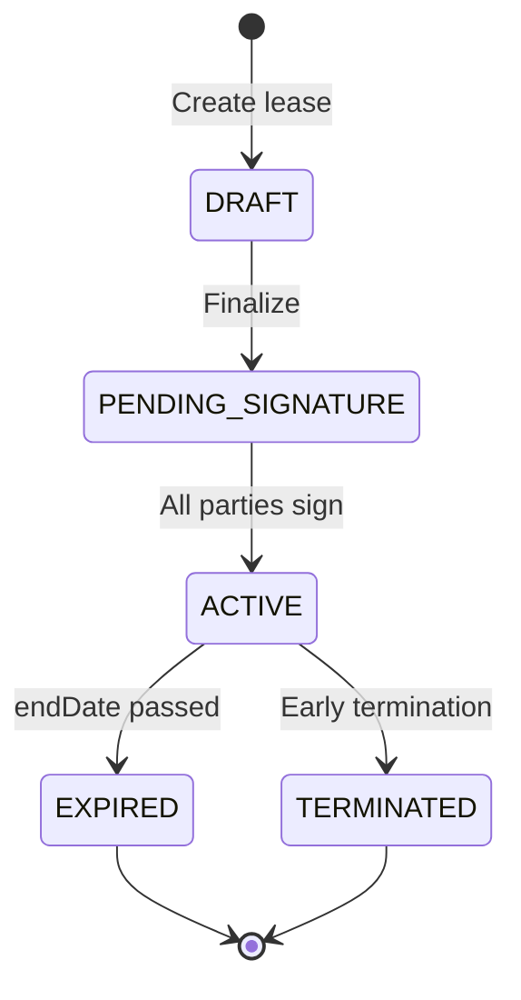

# Epic 2 — Tenant Management & Leasing: Full Implementation Plan

**Created:** 2026-01-04
**Updated:** 2026-01-04
**Status:** Planning Complete - Ready for Implementation
**Total Story Points:** 79 (55 MVP scope)

---

## Executive Summary

This document provides a comprehensive end-to-end implementation plan for Epic 2: Tenant Management & Leasing. After reviewing the current codebase, I've identified significant gaps between the existing implementation (mostly UI shells with mock data) and what's needed for a production-ready system.

### Current State Assessment

| Component | Status | Notes |
|-----------|--------|-------|
| Database Schema | ✅ Complete | Tenant, Lease, Pet, Inspection models exist |
| Tenant API | ✅ Complete | CRUD operations in `tenants.api.ts` |
| Lease API | ⚠️ Partial | Basic CRUD, missing renewal/termination |
| Pet API | ❌ Missing | No service files exist |
| Inspection API | ❌ Missing | No service files exist |
| Move-Out API | ❌ Missing | No service files exist |
| Tenant UI | ⚠️ Shell Only | Mock data, forms not connected |
| Lease UI | ⚠️ Shell Only | Mock data, multi-step form not functional |
| DB Migrations | ⚠️ Partial | Missing renewal link, move-out tables |

---

## Implementation Phases

### Phase 1: Core Tenant & Lease Foundation (Week 1-2)
**Priority: Critical - Unblocks all other Epic 2 work**

1. **EPM-21: Tenant Profile Creation** (8 points)
2. **EPM-24: Tenant List & Search** (5 points)
3. **EPM-20: Create New Lease Agreement** (13 points)

### Phase 2: Lease Lifecycle Management (Week 3-4)
**Priority: High - Core lease workflows**

4. **EPM-22: Lease Expiration Tracking** (8 points)
5. **EPM-23: Lease Renewal Workflow** (8 points)
6. **EPM-25: Tenant Detail Page** (8 points)

### Phase 3: Pet & Inspection Workflows (Week 5-6)
**Priority: High - Tenant lifecycle features**

7. **EPM-26: Pet Application & Approval** (8 points)
8. **EPM-27: Move-In Inspection** (8 points)

### Phase 4: Move-Out & Compliance (Week 7-8)
**Priority: High - MN compliance critical**

9. **EPM-28: Move-Out Process** (13 points)

---

## Detailed Implementation Tasks

---

## EPM-21: Tenant Profile Creation

### Goal
Create tenant record with contact info, optional additional fields, and secure handling of sensitive data.

### Current State
- ✅ API: `createTenant`, `getTenants`, `getTenant`, `updateTenant`, `deleteTenant` exist in `src/services/tenants.api.ts`
- ✅ Schema: `createTenantSchema`, `updateTenantSchema` exist in `src/services/tenants.schema.ts`
- ✅ Query hooks: Exist in `src/services/tenants.query.ts`
- ⚠️ UI: Form exists at `/app/tenants/new` but uses static form, NOT connected to API
- ⚠️ UI: Dialog in tenant list page also static

### Implementation Tasks

#### Backend Tasks
- [x] API endpoints implemented
- [x] Zod validation schemas
- [x] Prisma model exists
- [ ] **Add audit logging to createTenant/updateTenant**
- [ ] **Add SSN last-4 only validation (PII security)**
- [ ] **Add proper error handling with specific error codes**

#### Frontend Tasks
- [ ] **Wire up `app.tenants.new.tsx` form to `createTenant` mutation**
  - Use `useForm` from TanStack Form
  - Connect to `createTenantSchema` for validation
  - Add success/error toast notifications
  - Navigate to tenant detail on success
- [ ] **Add property/unit dropdown with live data** (fetch from properties/units APIs)
- [ ] **Add co-tenant management** (dynamic form array)
- [ ] **Add employment information section** (collapsible)
- [ ] **Add vehicle information section** (collapsible)
- [ ] **Implement SSN input with masking** (show last 4 only)
- [ ] **Add form persistence** (save draft to localStorage)

#### Test Tasks
- [ ] Unit test: Tenant email uniqueness validation
- [ ] Unit test: Required field validation
- [ ] Integration test: Create tenant flow
- [ ] E2E test: Full tenant creation journey

### Files to Modify/Create
```
src/routes/app.tenants.new.tsx       # Wire up form to API
src/services/tenants.api.ts          # Add audit logging
src/services/tenants.schema.ts       # Add SSN validation
src/components/forms/tenant-form.tsx # Extract reusable form component
```

### Acceptance Criteria
- [ ] Can create tenant with all required fields
- [ ] SSN stored as last 4 digits only
- [ ] Email uniqueness enforced
- [ ] Form validation matches schema
- [ ] Audit log created on tenant creation
- [ ] Success notification shown
- [ ] Redirects to tenant detail page

---

## EPM-24: Tenant List & Search

### Goal
Filter and search tenants by name/unit/email/phone and status with pagination and export.

### Current State
- ✅ API: `getTenants` with filters exists
- ✅ Schema: `tenantFiltersSchema` exists
- ⚠️ UI: Beautiful data table exists but uses **MOCK DATA**

### Implementation Tasks

#### Backend Tasks
- [x] API endpoint with filtering
- [ ] **Add property filter** (join through leases/units)
- [ ] **Add CSV export endpoint**
- [ ] **Optimize query performance** (add indexes if needed)

#### Frontend Tasks
- [ ] **Replace mock data with API call** in `app.tenants.index.tsx`
  - Use `useQuery` with `tenantsQueryOptions`
  - Wire up search input to `search` filter param
  - Wire up property filter to `propertyId` filter
  - Wire up payment status filter
- [ ] **Add pagination controls**
- [ ] **Add loading skeleton**
- [ ] **Add empty state**
- [ ] **Wire up CSV export button**
- [ ] **Fix inline editing** (currently local state only)

### Files to Modify
```
src/routes/app.tenants.index.tsx     # Replace mock data with API
src/services/tenants.api.ts          # Add exportTenants endpoint
src/services/tenants.query.ts        # Add export query
```

### Acceptance Criteria
- [ ] Tenant list populated from database
- [ ] Search filters by name/email/phone
- [ ] Property filter works
- [ ] Pagination works
- [ ] Export to CSV works
- [ ] Inline editing persists to database

---

## EPM-20: Create New Lease Agreement

### Goal
Create a lease for a unit and tenant with correct validations and financial term capture.

### Current State
- ✅ API: `createLease`, `getLeases`, `getLease`, `updateLease` exist
- ✅ Schema: `createLeaseSchema`, `leaseFiltersSchema` exist
- ✅ Overlap validation: Implemented in `createLease`
- ⚠️ UI: Multi-step form exists but uses **MOCK DATA**, not connected to API

### Implementation Tasks

#### Backend Tasks
- [x] API endpoints
- [x] Overlap validation
- [ ] **Add lease number generation** (already in schema but verify)
- [ ] **Add status transition validation** (DRAFT → PENDING_SIGNATURE → ACTIVE)
- [ ] **Add co-tenant connection** (LeaseTenant records)
- [ ] **Add addenda connection** (LeaseAddendum records)
- [ ] **Trigger document generation** (EPM-43 integration)

#### Frontend Tasks
- [ ] **Create multi-step form wizard component**
  - Step 1: Property & Unit selection (with live data)
  - Step 2: Tenant selection (with live data + ability to create new)
  - Step 3: Lease term & financial details
  - Step 4: Template & addenda selection
  - Step 5: Review & submit
- [ ] **Wire up property/unit dropdowns** to live APIs
- [ ] **Wire up tenant dropdown** to live API
- [ ] **Add date validation** (startDate < endDate)
- [ ] **Add overlap warning** (check for existing active leases on unit)
- [ ] **Add template preview**
- [ ] **Add addenda multi-select**
- [ ] **Add form state management** (multi-step with back/forward)
- [ ] **Generate lease document on creation** (call document generation API)

#### Workflow Implementation


### Files to Modify/Create
```
src/routes/app.leases.new.tsx           # Full rewrite as multi-step wizard
src/components/forms/lease-wizard/      # New directory for wizard steps
  step-1-property.tsx
  step-2-tenant.tsx
  step-3-terms.tsx
  step-4-addenda.tsx
  step-5-review.tsx
src/services/leases.api.ts              # Add finalizeLease, addCoTenant
src/services/leases.schema.ts           # Add status transition schemas
```

### Acceptance Criteria
- [ ] Can create lease with all required fields
- [ ] Property/unit populated from database
- [ ] Tenant populated from database (or can create new inline)
- [ ] Overlapping lease validation works
- [ ] Co-tenants can be added
- [ ] Addenda can be selected
- [ ] Lease document generated on finalization
- [ ] Status workflow enforced

---

## EPM-22: Lease Expiration Tracking

### Goal
Surface leases expiring soon (90/60/30 days) and enable action to renew.

### Current State
- ✅ API: `getExpiringLeases` exists returning grouped buckets
- ⚠️ UI: Stats cards exist but use mock data, no dashboard widget

### Implementation Tasks

#### Backend Tasks
- [x] API endpoint exists
- [ ] **Add email notification trigger** (integration with background jobs EPM-6)

#### Frontend Tasks
- [ ] **Create expiring leases dashboard widget** for main dashboard
- [ ] **Wire up lease list page** to show expiration badges
- [ ] **Add "Renew" quick action** on expiring leases
- [ ] **Add expiration date filter** to lease list
- [ ] **Color-code by urgency**:
  - <30 days: Red badge
  - 30-60 days: Yellow/Orange badge
  - 60-90 days: Gray badge

### Files to Modify/Create
```
src/components/dashboard/expiring-leases-widget.tsx  # New widget
src/routes/app.dashboard.tsx                         # Add widget
src/routes/app.leases.index.tsx                      # Replace mock data
```

### Acceptance Criteria
- [ ] Dashboard shows expiring leases widget
- [ ] Lease list shows expiration badges
- [ ] Can filter leases by expiration window
- [ ] Quick renew action available
- [ ] Color coding by urgency

---

## EPM-23: Lease Renewal Workflow

### Goal
Make renewals safe and auditable with status tracking.

### Current State
- ❌ API: No renewal-specific endpoints
- ❌ Schema: No renewal schemas
- ❌ DB: Missing `renewed_from_lease_id` column

### Implementation Tasks

#### Database Migration
```sql
-- migrations/00X_leases_renewal_link.sql
ALTER TABLE pm_leases
  ADD COLUMN IF NOT EXISTS renewed_from_lease_id UUID REFERENCES pm_leases(id);

CREATE INDEX IF NOT EXISTS idx_leases_renewed_from
  ON pm_leases(renewed_from_lease_id);
```

#### Backend Tasks
- [ ] **Create migration for renewal link column**
- [ ] **Update Prisma schema** with `renewedFromLeaseId` field
- [ ] **Create `src/services/lease-renewals.api.ts`**:
  ```typescript
  createLeaseRenewalFromLease(leaseId, newTerms)  // Creates DRAFT linked to prior
  finalizeLeaseRenewal(leaseId)                    // Transitions to PENDING_SIGNATURE
  ```
- [ ] **Create `src/services/lease-renewals.schema.ts`**:
  ```typescript
  createLeaseRenewalFromLeaseSchema
  finalizeLeaseRenewalSchema
  ```
- [ ] **Create `src/services/lease-renewals.query.ts`**

#### Frontend Tasks
- [ ] **Add "Renew Lease" button** on lease detail page
- [ ] **Create renewal wizard** (pre-populated from existing lease)
  - Shows current terms
  - Allows adjustment of rent, dates
  - Tracks rent increase percentage
- [ ] **Add renewal history section** on lease detail
- [ ] **Update expiring leases widget** with one-click renew

### Files to Create
```
supabase/migrations/00X_leases_renewal_link.sql
prisma/schema.prisma                              # Update Lease model
src/services/lease-renewals.api.ts
src/services/lease-renewals.schema.ts
src/services/lease-renewals.query.ts
src/components/leases/renewal-wizard.tsx
```

### Acceptance Criteria
- [ ] Can initiate renewal from active lease
- [ ] New lease linked to prior via `renewedFromLeaseId`
- [ ] Terms pre-populated with option to adjust
- [ ] Renewal history visible on lease detail
- [ ] Original lease remains until new lease activated

---

## EPM-25: Tenant Detail Page

### Goal
Single tenant view: contact info, lease summary, payment history, documents, maintenance.

### Current State
- ✅ API: `getTenant` includes related data (leases, pets, payments, maintenance, documents)
- ⚠️ UI: Route exists but needs full implementation with real data

### Implementation Tasks

#### Frontend Tasks
- [ ] **Wire up tenant detail page** to `getTenant` API
- [ ] **Create overview section**:
  - Contact information (editable inline)
  - Emergency contact
  - Employment info
  - Vehicle info
- [ ] **Create active lease section**:
  - Lease summary card
  - Quick actions (view lease, renew, terminate)
  - Unit/property link
- [ ] **Create payment history table**:
  - Recent payments
  - Current balance
  - Quick record payment action
- [ ] **Create maintenance requests section**:
  - Active requests
  - History
  - Quick create request
- [ ] **Create documents section**:
  - Lease documents
  - ID documents
  - Ability to upload new
- [ ] **Create pets section**:
  - List of pets
  - Status badges (approved/pending)
  - Quick add pet
- [ ] **Create communication log section**:
  - Recent messages
  - Quick send message

### Files to Modify
```
src/routes/app.tenants.$tenantId.tsx   # Full implementation
src/components/tenants/
  tenant-overview.tsx
  tenant-lease-card.tsx
  tenant-payments.tsx
  tenant-maintenance.tsx
  tenant-documents.tsx
  tenant-pets.tsx
  tenant-communications.tsx
```

### Acceptance Criteria
- [ ] All sections populated from API
- [ ] Can edit tenant info inline
- [ ] Can navigate to related entities
- [ ] Can perform quick actions
- [ ] Loading and error states

---

## EPM-26: Pet Application & Approval

### Goal
Capture pet application and approval workflow tied to tenant/lease terms.

### Current State
- ✅ DB: Pet model exists with status enum
- ❌ API: No pet service files
- ❌ UI: No pet management UI

### Implementation Tasks

#### Backend Tasks
- [ ] **Create `src/services/pets.api.ts`**:
  ```typescript
  getPets(tenantId)           // List tenant's pets
  getPet(id)                  // Get single pet
  createPet(tenantId, data)   // Create pending pet application
  updatePet(id, data)         // Update pet info
  approvePet(id)              // Approve pet application
  denyPet(id, reason)         // Deny pet application
  removePet(id)               // Mark pet as removed
  ```
- [ ] **Create `src/services/pets.schema.ts`**:
  ```typescript
  petStatusEnum = z.enum(['PENDING', 'APPROVED', 'DENIED', 'REMOVED'])
  petTypeEnum = z.enum(['DOG', 'CAT', 'BIRD', 'FISH', 'REPTILE', 'SMALL_MAMMAL', 'OTHER'])
  createPetSchema
  updatePetSchema
  approvePetSchema
  denyPetSchema
  ```
- [ ] **Create `src/services/pets.query.ts`**
- [ ] **Add vaccination document upload** (Supabase Storage integration)
- [ ] **Add pet addendum generation** on approval

#### Frontend Tasks
- [ ] **Create pet application form**:
  - Type, name, breed, weight, age
  - Vaccination status & expiry
  - Photo upload
  - Notes
- [ ] **Create pet approval workflow UI**:
  - Pending applications queue
  - Approve/Deny actions with reason
- [ ] **Add pets section to tenant detail page**
- [ ] **Add pet addendum to lease on approval**

### Files to Create
```
src/services/pets.api.ts
src/services/pets.schema.ts
src/services/pets.query.ts
src/routes/app.pets.tsx                  # Pets queue for manager
src/components/pets/
  pet-application-form.tsx
  pet-card.tsx
  pet-approval-dialog.tsx
```

### Acceptance Criteria
- [ ] Tenant can submit pet application
- [ ] Manager sees pending applications
- [ ] Can approve/deny with reason
- [ ] Pet addendum generated on approval
- [ ] Pet rent/deposit tracked

---

## EPM-27: Move-In Inspection

### Goal
Digital inspection with photos and structured items.

### Current State
- ✅ DB: Inspection and InspectionItem models exist
- ❌ API: No inspection service files
- ❌ UI: No inspection UI

### Implementation Tasks

#### Backend Tasks
- [ ] **Create `src/services/inspections.api.ts`**:
  ```typescript
  createInspection(propertyId, leaseId, type, scheduledDate)
  getInspections(filters)
  getInspection(id)
  addInspectionItem(inspectionId, item)
  updateInspectionItem(itemId, data)
  deleteInspectionItem(itemId)
  completeInspection(id, signature)
  generateInspectionReport(id)  // PDF generation
  ```
- [ ] **Create `src/services/inspections.schema.ts`**:
  ```typescript
  inspectionTypeEnum = z.enum(['MOVE_IN', 'MOVE_OUT', 'ROUTINE', 'MAINTENANCE', 'SAFETY', 'ANNUAL'])
  inspectionStatusEnum = z.enum(['SCHEDULED', 'IN_PROGRESS', 'COMPLETED', 'CANCELLED'])
  conditionEnum = z.enum(['NEW', 'GOOD', 'FAIR', 'POOR', 'DAMAGED'])
  createInspectionSchema
  addInspectionItemSchema
  updateInspectionItemSchema
  ```
- [ ] **Create `src/services/inspections.query.ts`**
- [ ] **Add photo upload** to Supabase Storage
- [ ] **Add signature capture** (canvas or typed)
- [ ] **Add PDF report generation**

#### Frontend Tasks
- [ ] **Create inspection form wizard**:
  - Property/unit/lease selection
  - Room-by-room checklist
  - Condition rating per item
  - Photo upload per item
  - Notes field
- [ ] **Create room templates**:
  - Living Room, Kitchen, Bathroom, Bedroom, etc.
  - Standard items per room (walls, flooring, windows, etc.)
- [ ] **Create signature capture component**
- [ ] **Create inspection report preview**
- [ ] **Add inspection section to lease detail**

### Files to Create
```
src/services/inspections.api.ts
src/services/inspections.schema.ts
src/services/inspections.query.ts
src/routes/app.inspections.tsx                   # Inspections list
src/routes/app.inspections.$inspectionId.tsx     # Inspection detail
src/routes/app.inspections.new.tsx               # New inspection
src/components/inspections/
  inspection-form.tsx
  inspection-item-form.tsx
  room-checklist.tsx
  condition-rating.tsx
  photo-upload.tsx
  signature-capture.tsx
```

### Acceptance Criteria
- [ ] Can create move-in inspection for lease
- [ ] Room-by-room checklist works
- [ ] Photos upload to storage
- [ ] Condition ratings saved
- [ ] Digital signature captured
- [ ] PDF report generated
- [ ] Inspection linked to lease

---

## EPM-28: Move-Out Process

### Goal
Move-out workflow: schedule inspection, compare conditions, compute damages, produce deposit disposition letter (MN compliance).

### Current State
- ❌ DB: Missing `move_out_damage_items` and `deposit_disposition_letters` tables
- ❌ API: No move-out service files
- ❌ UI: No move-out UI

### Implementation Tasks

#### Database Migrations
```sql
-- migrations/00X_move_out_damage_items.sql
CREATE TABLE IF NOT EXISTS move_out_damage_items (
  id UUID PRIMARY KEY DEFAULT gen_random_uuid(),
  inspection_id UUID NOT NULL REFERENCES inspections(id) ON DELETE CASCADE,
  lease_id UUID NOT NULL REFERENCES pm_leases(id) ON DELETE CASCADE,
  room TEXT NOT NULL,
  item TEXT NOT NULL,
  description TEXT,
  estimated_repair_cost DECIMAL(10, 2) NOT NULL DEFAULT 0,
  created_at TIMESTAMPTZ DEFAULT NOW()
);

CREATE INDEX IF NOT EXISTS idx_move_out_damage_items_inspection
  ON move_out_damage_items(inspection_id);

-- migrations/00X_deposit_disposition_letters.sql
CREATE TABLE IF NOT EXISTS deposit_disposition_letters (
  id UUID PRIMARY KEY DEFAULT gen_random_uuid(),
  lease_id UUID NOT NULL REFERENCES pm_leases(id) ON DELETE CASCADE,
  status TEXT NOT NULL DEFAULT 'DRAFT',
  document_url TEXT,
  sent_at TIMESTAMPTZ,
  delivery_error TEXT,
  -- Financial details
  deposit_amount DECIMAL(10, 2) NOT NULL,
  interest_earned DECIMAL(10, 2) DEFAULT 0,
  total_deductions DECIMAL(10, 2) DEFAULT 0,
  refund_amount DECIMAL(10, 2),
  -- MN Compliance
  move_out_date DATE NOT NULL,
  disposition_deadline DATE NOT NULL, -- 21 days from move-out
  -- Metadata
  created_at TIMESTAMPTZ DEFAULT NOW(),
  updated_at TIMESTAMPTZ DEFAULT NOW()
);

CREATE INDEX IF NOT EXISTS idx_deposit_disposition_letters_lease
  ON deposit_disposition_letters(lease_id);
```

#### Backend Tasks
- [ ] **Create migrations** for damage items and disposition letters
- [ ] **Update Prisma schema** with new models
- [ ] **Create `src/services/move-out.api.ts`**:
  ```typescript
  createMoveOutInspection(leaseId)         // Creates MOVE_OUT inspection
  recordMoveOutDamages(inspectionId, items) // Record damage line items
  compareMoveInMoveOut(leaseId)            // Compare inspections
  calculateDepositDisposition(leaseId)     // Calculate refund/deductions
  generateDepositDispositionLetter(leaseId) // PDF with MN requirements
  sendDepositDispositionLetter(letterId)   // Send via email
  processDepositRefund(leaseId, amount)    // Initiate refund payment
  ```
- [ ] **Create `src/services/move-out.schema.ts`**:
  ```typescript
  damageLineItemSchema
  recordMoveOutDamagesSchema
  depositDispositionSchema
  ```
- [ ] **Create `src/services/move-out.query.ts`**
- [ ] **Implement MN compliance rules**:
  - 21-day deadline tracking
  - 1% annual interest calculation
  - Required disclosure language

#### Frontend Tasks
- [ ] **Create move-out process wizard**:
  - Step 1: Schedule move-out inspection
  - Step 2: Conduct inspection (compare to move-in)
  - Step 3: Record damages & costs
  - Step 4: Calculate deposit disposition
  - Step 5: Generate & send letter
  - Step 6: Process refund or invoice
- [ ] **Create damage comparison view**:
  - Side-by-side move-in vs move-out
  - Highlight differences
  - Cost estimation
- [ ] **Create deposit disposition letter preview**
- [ ] **Add compliance warnings**:
  - Deadline countdown
  - Missing required info

### Files to Create
```
supabase/migrations/00X_move_out_damage_items.sql
supabase/migrations/00X_deposit_disposition_letters.sql
prisma/schema.prisma                            # Add new models
src/services/move-out.api.ts
src/services/move-out.schema.ts
src/services/move-out.query.ts
src/routes/app.move-out.$leaseId.tsx            # Move-out process
src/components/move-out/
  move-out-wizard.tsx
  damage-comparison.tsx
  damage-line-item.tsx
  disposition-calculator.tsx
  disposition-letter-preview.tsx
  compliance-warnings.tsx
```

### MN Compliance Requirements
- **21-Day Deadline**: Must provide deposit disposition within 21 days of move-out
- **Interest Calculation**: 1% annual simple interest on security deposit
- **Required Disclosures**: Bank name, itemized deductions, refund check
- **Certified Mail**: Disposition letter should be sent certified mail

### Acceptance Criteria
- [ ] Can schedule move-out inspection
- [ ] Can compare move-in vs move-out conditions
- [ ] Damages itemized with costs
- [ ] Interest calculated correctly
- [ ] Disposition letter generated with required disclosures
- [ ] 21-day deadline tracked
- [ ] Can send letter and process refund
- [ ] Lease status updated to TERMINATED

---

## Cross-Cutting Concerns

### Error Handling
All Epic 2 endpoints should use consistent error handling:
```typescript
try {
  // operation
} catch (error) {
  if (error.code === 'P2002') {
    throw new Error('Duplicate entry')
  }
  throw error
}
```

### Audit Logging
All mutations should create audit log entries:
```typescript
await prisma.auditLog.create({
  data: {
    action: 'CREATE',
    entityType: 'Tenant',
    entityId: tenant.id,
    newValues: tenant,
    userId: context.auth.user.id,
  },
})
```

### Authorization
All endpoints must verify:
1. User is authenticated
2. User has access to the entity (via property ownership)

### Loading States
All UI components should implement:
- Loading skeleton
- Error boundary
- Empty state
- Retry capability

---

## Testing Strategy

### Unit Tests
- Schema validation tests
- Service function tests (mocked Prisma)
- Component render tests

### Integration Tests
- API endpoint tests
- Database constraint tests

### E2E Tests (Playwright)
- Full tenant creation flow
- Full lease creation flow
- Move-in inspection flow
- Move-out process flow

---

## Dependencies & Prerequisites

### Completed (Ready to Use)
- ✅ EPM-1: Database schema
- ✅ EPM-2: Supabase Storage
- ✅ EPM-7: API Service Layer
- ✅ EPM-77: Stripe Integration
- ✅ EPM-43: Lease Document Generation (partial)

### Parallel Work Possible
- EPM-34: Record Rent Payments (can develop in parallel)
- EPM-29: Maintenance Requests (can develop in parallel)

---

## Estimated Effort

| Issue | Story Points | Estimated Days | Priority |
|-------|--------------|----------------|----------|
| EPM-21 | 8 | 3-4 | P0 |
| EPM-24 | 5 | 2 | P0 |
| EPM-20 | 13 | 5-6 | P0 |
| EPM-22 | 8 | 2-3 | P1 |
| EPM-23 | 8 | 3-4 | P1 |
| EPM-25 | 8 | 3-4 | P1 |
| EPM-26 | 8 | 3-4 | P1 |
| EPM-27 | 8 | 4-5 | P1 |
| EPM-28 | 13 | 6-8 | P1 |

**Total: 79 story points, ~31-40 dev days (6-8 weeks for 1 developer)**

---

## Implementation Order

### Sprint 1 (Week 1-2): Foundation
1. EPM-21: Tenant Profile - Wire up create form
2. EPM-24: Tenant List - Replace mock data
3. EPM-20: Lease Creation - Multi-step wizard

### Sprint 2 (Week 3-4): Lease Lifecycle
4. EPM-22: Expiration Tracking - Dashboard widget
5. EPM-23: Lease Renewal - Renewal workflow
6. EPM-25: Tenant Detail - Full implementation

### Sprint 3 (Week 5-6): Pet & Inspections
7. EPM-26: Pet Application - Full service layer
8. EPM-27: Move-In Inspection - Full service layer

### Sprint 4 (Week 7-8): Move-Out
9. EPM-28: Move-Out Process - Full service layer with MN compliance

---

## Open Questions

1. **SSN Handling**: Store last 4 only, or implement field-level encryption?
   - **Recommendation**: Last 4 only for MVP, full encryption in Phase 2

2. **Pet Photo Storage**: Where to store pet photos?
   - **Recommendation**: Supabase Storage "media" bucket, same as inspection photos

3. **Signature Capture**: Canvas signature or typed name?
   - **Recommendation**: Support both, typed name for MVP

4. **PDF Generation**: Server-side or client-side?
   - **Recommendation**: Server-side for consistency, use React-PDF

5. **Email Delivery**: Integrate with EPM-4 SendGrid now or later?
   - **Recommendation**: Now - needed for disposition letter delivery

---

## Next Steps

1. ✅ Complete this planning document
2. [ ] Review with team
3. [ ] Create Linear issues for each task
4. [ ] Start Sprint 1 implementation
